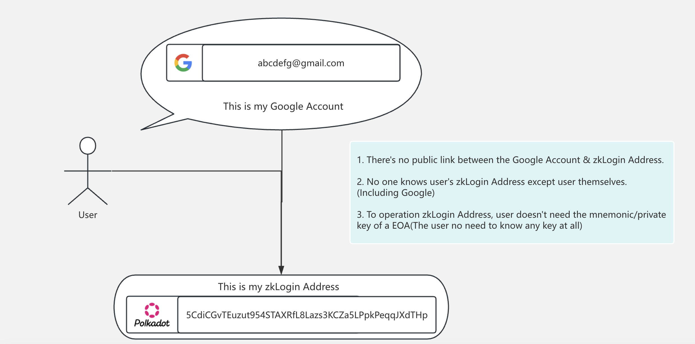
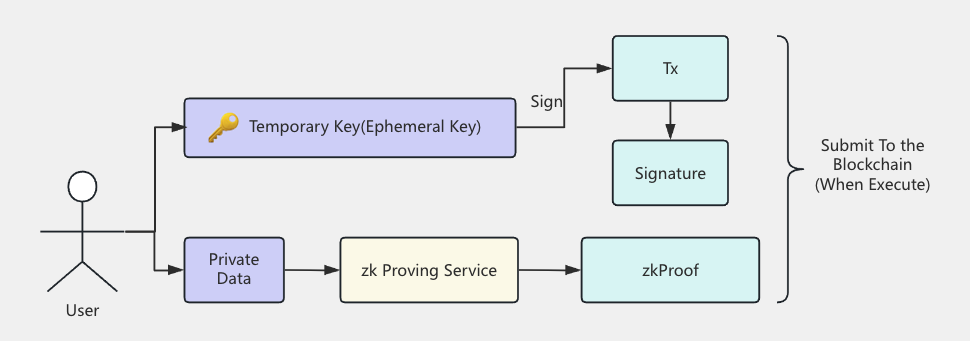
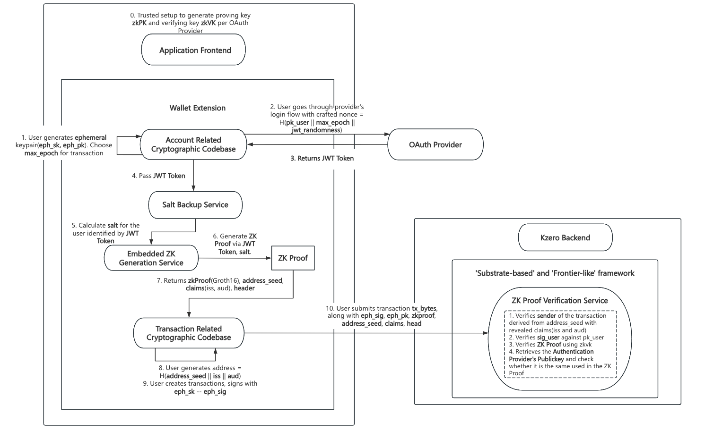

# Kzero Overview

## 1. What is Kzero? -- bring simpler & safer AA to Polkadot

The `Kzero`  is built on `WebAuthn` technology and exists as a **Runtime Pallet**, eliminating the need for any modifications to Polkadot's existing architecture. Any project can integrate `Kzero` by simply adding the Runtime Pallet.
> `WebAuthn` is a modern authentication standard offering robust identity verification. Integrating such identity verification features within the Polkadot ecosystem would enhance security and provide users with more authentication options. 

Specifically, it allows users to bypass the traditional login process associated with externally owned accounts (EOAs), freeing them entirely from the reliance on seed phrases. Instead, Kzero utilizes `Google` accounts as the medium for user authentication, proving ownership of the `Google` account as a way to demonstrate ownership of the corresponding on-chain address.



The complexity of wallets has long been a barrier for new users entering the blockchain space, and `Kzero` is the perfect solution to this problem. By utilizing cutting-edge cryptography and technology, `Kzero` offers a seamless and secure approach.

When creating a traditional blockchain address, the address is associated with a permanent public-private key pair, and the address is derived from the public key. In contrast, with `Kzero`, the address is derived from a combination of the `Google JWT` and the user’s unique `user_salt`, making the user unaware of any private key throughout the transaction process. The user’s identity is verified via `Google`’s OAuth service.

In short, the `Kzero` process can be broken down into the following key steps:


Step 1: Generate a Temporary(Ephemeral) Key:
When the user opens the application, a temporary key pair is generated for them. This key pair has an expiration time, which determines how often the user will need to log in(when the expiration time is reached, the key pair becomes invalid).

Step 2: Request a JWT from Google:
The application prompts the user to authenticate themselves via an OAuth provider (such as `Google`), generating a JSON Web Token (JWT) that serves as a payload of the provider’s digitally signed data. In `Kzero`, the JWT includes a `nonce` field containing the `public key` and the `expiration time`. The JWT embeds `key claims`, which are later used to generate a Polkadot address.

Step 3: Request the User's Unique Salt:
The salt (a common cryptographic term for random data) is an arbitrary numeric string. It is used in conjunction with the `JWT` and the `temporary key pair` to associate the OAuth credentials with the Polkadot address.

Step 4: Generate a Zero-Knowledge Proof:
Using the `JWT`, `salt`, and `public key`, user can generate a zero-knowledge (zk) proof from a zk-proof service. This proof verifies that the user's identity has been authenticated by `Google` and confirms the validity of the user's temporary key.

Step 5: Identify the User's Polkadot Address and Build a Transaction:
The application identifies the user’s Polkadot address based on the `salt` and `key claims` extracted from the JWT. During submission, the app adds the `temporary signature`, `zk proof`, and some other auxiliary data.

Step 6: Verify the Transaction:
Once on the blockchain, the `Kzero` Runtime Pallet thoroughly verifies the `zk proof` and `temporary signature` for authentication, seamlessly completing the entire process.


**From privacy perspective**
- There is **no public link** between the Google Account and the Kzero Address.
- **No one knows the user's Kzero Address** except the user themselves, including Google.(This is due to the requirement of a unique salt during the transition from a Google account to a Kzero account. This salt is private and held by the user, meaning that even Google cannot determine the user's on-chain address.)

**From security perspective**
- Users no longer need to worry about losing access to their wallets due to the loss of a private key, as is the case with externally owned accounts (EOAs). 
- The only scenario in which a user could potentially lose access to their funds is if, before the expiration time, they simultaneously lose their temporary private key, JWT, and salt.


The integration of Kzero could be a promising direction for the future development of the Polkadot ecosystem, which helps elevate the security and convenience of users' digital identities, eliminating reliance on passwords reduces the risks of phishing, brute force attacks, and replay attacks, providing a simpler and faster login process for both Web2 & Web3 Users.


## 2. Details of Kzero Solution 

Kzero provides the ability for Users to send transactions from a Polkadot `zkaddress` using an `OAuth` credential, without publicly linking the two.


This is one of the simplest ways to onboard Users onto the blockchain. Kzero allows users to log in to Web3 applications using existing Web2 Authentication Providers like `Google`, eliminating the need for users to remember or record private keys.

`Kzero` provides great convenience for end users without compromising security. It connects the responses from Web2 Authentication Providers to specific Polkadot accounts using ephemeral keypairs and zero-knowledge cryptography. When using `Kzero`, the only data submitted to the blockchain is the zero-knowledge proof, a temporary signature and some auxiliary data, eliminating the need to submit any user information to the blockchain. Additionally, Web2 Authentication Providers are unaware that users are using the blockchain, ensuring privacy.

### Why using zk?
The use of zero-knowledge proofs (ZKPs) is aimed at ensuring that users do **not expose any private data**. The following tasks are accomplished within the framework of zero-knowledge proofs:

1. Verifying that `the nonce` provided to `Google` for authentication complies with Kzero rules, specifically:
```js=
jwt_token.payload.nonce = H(eph_pk, max_epoch, jwt_randomness).
```
2. Validating the user's JWT token: to prove that the JWT Token was indeed signed by `Google`.
3. Confirming that the user's `zkAddress` adheres to the generation rules, which is calculated as:
```js=
address = H(jwt_token.payload.iss, H(user_salt, jwt_token.payload.aud, jwt_token.payload.sub)).
```
These calculations involve the user's private data and are performed locally on the user's device. Only the zero-knowledge proof is submitted to the blockchain for verification, effectively preventing malicious impersonation attacks. 

The zero-knowledge proof represents that only a specific temporary key has the right to manipulate a given `zkAddress` within a designated timeframe(before the `expirationTime`). Subsequently, when the user trys to execute a transaction, they need to provide the 'signature signed by the temporary key' along with the 'zero-knowledge proof'.



In the endeavor to integrate the Kzero framework into the Polkadot ecosystem, some pivotal aspects are as follows(including both the `Frontend` and `Backend`):

### Detailed WorkFlow



(Step 0) We use Groth16 for our protocol's zkSNARK instantiation, requiring a singular generation of a structured common reference string (CRS) linked to the circuit. A ceremony is conducted to generate the CRS, which is used to produce the proving key in the ZK Proving Service, the verifying key in Project Authority. 

(Step 1-3) The user begins by logging into an OpenID Provider (OP) to obtain a JWT token containing a defined nonce. In particular, the user generates an ephemeral KeyPair (`eph_sk`, `eph_pk`), along with expiry times (`max_epoch`) and randomness (`jwt_randomness`). Through these three parameters, the Wallet Extension can thus compute the `nonce`. After the user completes the OAuth login flow, an JWT token can be retrieved.

(Step 4-5) The Account Related Module then sends the JWT token to a Salt Backup Service. The Salt Backup Service returns the unique `user_salt` based on `iss`, `aud`, `sub` upon validation of the JWT token.

(Step 6-7) The Wallet Extension sends the ZK Generation Service with the JWT token, `user_salt`, `eph_pk`, `jwt_randomness`,and some other inputs. The proving service generates a Zero-Knowledge Proof that takes these as private inputs and does the following: a) Checks the nonce is derived correctly as defined b) Checks that key claim value matches the corresponding field in the JWT, c) Verifies the RSA signature from OP on the JWT, and d) the address is consistent with the key claim value and user salt.

(Step 8): The Wallet Extension computes the user address based on iss, aud, sub, aud. This step can be done independently as long as the Wallet Extension has a valid JWT token.

(Step 9-10) A transaction is signed using the ephemeral private key to generate an ephemeral signature. Finally, the user submits the transaction along with the ephemeral signature, ZK proof and other inputs to Chain.

(After Step 10) After submitted on chain, Our 'Substrate-based' and 'Frontier-like' framework verifies the ZK proof against the provider JWKs from storage (agreed upon in consensus) and also the ephemeral signature.

## 3. Additional Resources

For more detailed information and implementation details, please refer to the following KZero repositories:

- **kzero-service**: [https://github.com/kzero-xyz/kzero-service](https://github.com/kzero-xyz/kzero-service) - Backend services including auth-server, proof-server, and proof-worker
- **kzero-wallet**: [https://github.com/kzero-xyz/kzero-wallet](https://github.com/kzero-xyz/kzero-wallet) - Wallet SDK and example applications
- **kzero**: [https://github.com/kzero-xyz/kzero](https://github.com/kzero-xyz/kzero) - Core KZero project repository
- **kzero-salt-enclave-service**: [https://github.com/kzero-xyz/kzero-salt-enclave-service](https://github.com/kzero-xyz/kzero-salt-enclave-service) - Salt generation service with Intel SGX enclave support
- **kzero-mvp-demo**: [https://github.com/kzero-xyz/kzero-mvp-demo](https://github.com/kzero-xyz/kzero-mvp-demo) - MVP demonstration and example implementations
