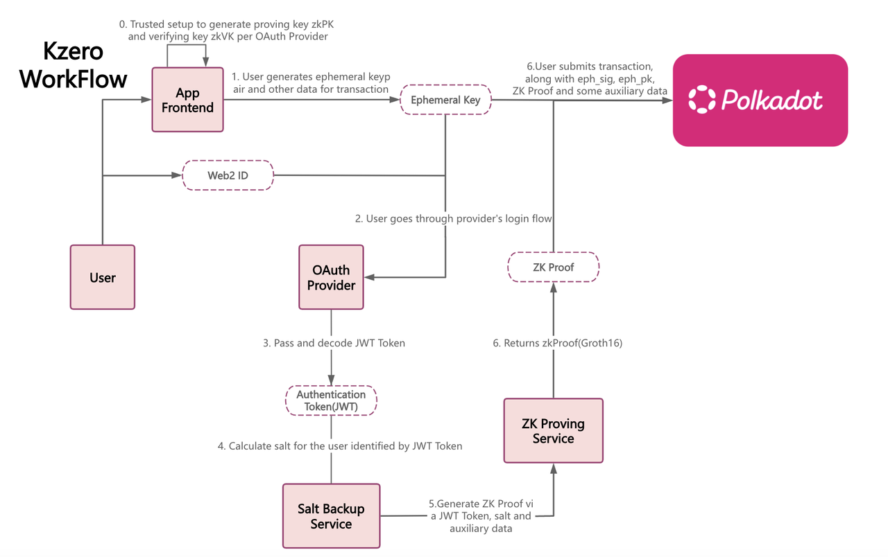
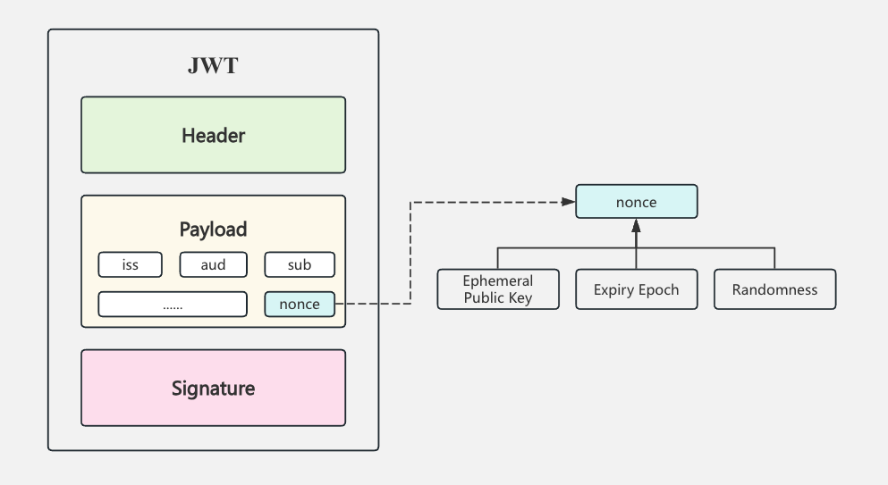
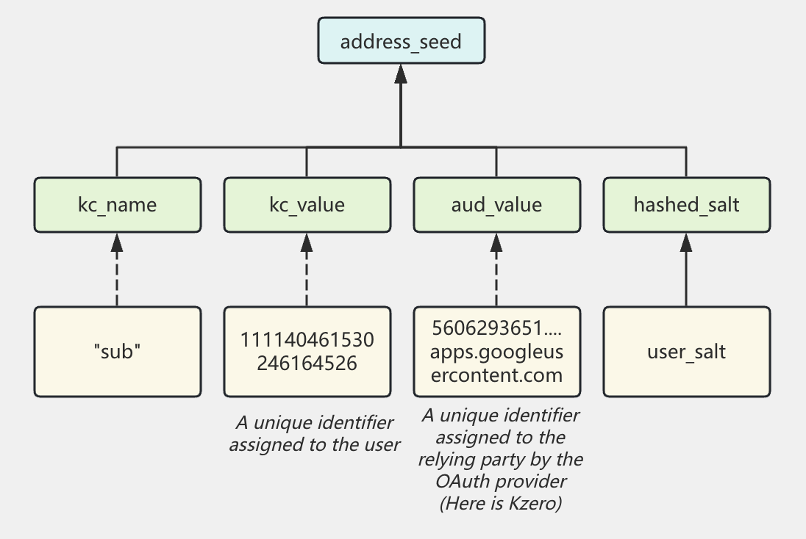

# Abstract
Kzero generates user on-chain accounts through OAuth2 providers. Users log in via their social accounts and obtain a JSON Web Token (JWT). This token is then combined with some user-defined data and sent to a service that generates a Zero-Knowledge Proof (ZKP). This is where Kzero ZK Circuit comes to work. The ZKP verifies that the user is the legitimate account owner without revealing their identity or any private information on-chain. Once authenticated, the user can perform transactions via their kzero account, just like a regular Polkadot account.

This technical specification starts with providing a comprehensive overview of the process, focusing on the cryptographic details involved. For detailed circuit-specific information, please refer to the [Circuit Spec](#Circuit-Spec) section.

# Overview
## Terms
Before diving into the details of the kzero circuit, let’s first define some key terms.

### JSON Web Key (JWK)
A JSON data structure that represents a set of public keys for an OAuth2 Provider. A public endpoint (as in https://www.googleapis.com/oauth2/v3/certs) can be queried to retrieve the valid public keys corresponding to kid for the provider. Upon matching with the kid in the header of a JWT, the JWT can be verified against the payload and its corresponding JWK.

### JSON Web Token (JWT)
JSON Web Token is an open industry standard ([RFC 7519](https://datatracker.ietf.org/doc/html/rfc7519)). It contains JSON objects which have the information that needs to be shared. A JWT is a signed payload from OAuth2 providers, including a user-defined field named nonce. Kzero leverages the OpenID Connect OAuth flow by defining the nonce as a public key, an expiry epoch and a randomness.
The JWT contains a header, payload, and a signature. The signature is an RSA signature verified against jwt_message = header + . + payload and its JWK identified by kid. The payload contains a JSON of many claims that is a name-value pair. See below for the specific claims that are relevant to the Kzero protocol.

- Header

| Name | Example Value | Usage |
| -------- | -------- | -------- |
| alg     | RS256| Supports RS256 (RSA + SHA-256)|
| kid     | a49391bf52b58c1d560255c2f2a04e59e22a7b65| Identifies the JWK that should be used to verify the JWT.  |
| typ     | JWT|Specify it is a JWT|

- Payload

| Name  | Example Value| Usage|
| ----- | -------- | -------- |
| iss   | https://accounts.google.com| A unique identifier assigned to the OAuth provider.|
| aud   | 560629365517-mt9j9arflcgi35i8hpoptr66qgo1lmfm .apps.googleusercontent.com | A unique identifier assigned to the relying party by the OAuth provider. Here is Kzero.|
| nonce | rV4AldU-0sxc10MOEF8igxiA0| A user-defined field. The Kzero enabled wallet is required to set this to the hash of ephemeral public key, an expiry time and a randomness. |
| sub   | 111140461530246164526| A unique identifier assigned to the user.|
 
### Nonce
An application-defined field embedded in the JWT payload, computed as the hash of the ephemeral public key, JWT randomness, and the maximum epoch (also defined expiry epoch).

### Ephemeral Key
 The wallet safely stores an ephemeral KeyPair, where the ephemeral public key is used in the nonce. The ephemeral private key signs transactions for a brief session, eliminating the need for user memorization.
 A transaction is submitted on-chain with the ephemeral signature and the ZK proof. And then the on-chain runtime-pallet executes the transaction after verifying the ephemeral signature and the proof.
 
### Max Epoch(Expiry Epoch)
 The epoch at which the Ephemeral Key expires. Users can define the expiration time of their Ephemeral Key and adjust this parameter based on their security strategy.

### User Salt
A value introduced to unlink the OAuth Credential with the on-chain address. The on-chain address is derived from 'JWT' and 'User Salt'. So even the OAuth Provider doesn't know the on-chain address is related to the user.

### Address Seed
Used to generate the user's on-chain address, which is derived from the hash of four fields:
    - `kc_name_F`: The key claim name, e.g. sub.
    - `kc_value_F`: The key claim value, e.g. 110463452167303000000.
    - `aud_value_F`: A unique identifier assigned to the relying party by the OAuth provider. Here is Kzero.
    - `hashed_salt`: The hash result of the User Salt set by user.(As you can see, with different User Salt, user can derive different Kzero Account with only one Social Account)
    
## How it works?
In rough sketches, the Kzro protocol relies on the following:

- A JWT is a signed payload from OAuth providers, including a user-defined field named nonce. Kzero leverages the OpenID Connect OAuth flow by defining the nonce as a public key, an expiry epoch and a randomness.
- The User locally generate an ephemeral keyPair, where the ephemeral public key is defined in the nonce. The ephemeral private key signs transactions for a brief session, eliminating the need for user memorization. The Groth16 zero-knowledge proof is generated based on the JWT, concealing privacy-sensitive fields.
- A transaction is submitted on-chain with the ephemeral signature and the ZK proof. The on-chain runtime-pallet executes the transaction after verifying the ephemeral signature and the proof.
- Instead of deriving the Polkadot address based on a public key, the Kzero address is derived from sub (that uniquely identifies the user per provider), iss (identifies the provider), aud (identifies the application) and user_salt (a value that unlinks the OAuth identifier with the on-chain address).

## Identity Authentication

### User Social Account <==> OAuth2 Provider

Users authenticate through an OAuth2 provider (Google is used as an example in this Spec). After logging in via Google, the user receives a JWT (JSON Web Token) signed by Google. But how is this JWT used in the subsequent process to verify the user’s identity?

To address this, let's introduce a custom field in JWT: `nonce`.

The nonce is defined as the hash of the ephemeral public key, an expiry time, and a randomness value. Before filling in the nonce field, the user must locally generate an ephemeral key and then hash: its public key, the public key’s expiry time, and a randomness value chosen by the user.

This randomness is known only to the user, making it impossible for anyone to reverse-engineer the user's public key through hash collisions. Even Google cannot establish a link between the ephemeral public key and the user's Google account, as Google is unaware of the actual ephemeral public key.

Now, the user's ephemeral key serves as proof of their identity—the holder of the ephemeral key is the same user authenticated by the JWT.

Even though we cannot directly extract the corresponding ephemeral public key from the JWT (by design, for privacy reasons), this isn't a problem. Only the user knows their ephemeral public key, and we let them prove that they possess the exact same key hidden within the JWT—using zero-knowledge proofs (This is where ZKP comes to help)!

### User Social Account  <==> Zero-Knowledge Proof
The user provides the locally generated ephemeral public key, expiry epoch, randomness, and additional metadata as secret inputs to the zero-knowledge proof (ZKP) circuit. The circuit performs the following verifications:
1. Nonce Construction: Computes the hash of the ephemeral public key, expiry epoch, and randomness, then assembles the nonce, and check the nonce is actually exist in the JWT's payload.
2. JWT Structure and Claims Verification: Parses and validates the structure of the JWT, extracts and reconstructs the payload, and verifies that it matches the payload embedded in the JWT.
3. JWT RSA Signature Verification: Verifies the JWT’s authenticity using RSA signature verification within the ZKP circuit. Since OAuth2 providers periodically rotate their JSON Web Keys (JWKs), the actual JWK verification is delegated to an on-chain verification process to ensure that the JWT was signed by Google.
4. Address Seed Computation: Computes the addressSeed within the ZKP circuit. To preserve privacy, the UserSalt is provided as a secret input and used in the computation. This ensures that the resulting addressSeed remains unlinkable to the user’s identity from an external perspective.
5. Other extra checks...

After processing through the ZKP circuit, the user obtains a zero-knowledge proof verifying that their ephemeral key was authenticated via Google’s JWT verification. This proof ensures that any transaction signed with the ephemeral key is cryptographically linked to the authenticated user and is authorized to manage their on-chain account.

The next question is: which on-chain account does this ephemeral key control? Let’s examine this in the following section.

### User Social Account  <==> On-chain Address

Within the zero-knowledge proof circuit, we compute the address seed, which is derived by hashing the `kc_name`, `kc_value_F`, `aud_value_F`(from the JWT), and `hashed_salt`(provided by the user, enables the management of multiple on-chain accounts linked to the same social account.) . 

On-chain, this address seed is used to deterministically derive the corresponding Polkadot on-chain account.

As a result, the user can sign transactions using their JWT-authenticated ephemeral key, attach the zero-knowledge proof, and submit the transaction on-chain. Once the ZKP is successfully verified, the transaction is authorized, allowing the user to control their on-chain Polkadot account.

For a given user and a fixed UserSalt, the address seed remains constant. This means that each time the user authenticates via OAuth2, even if they rotate their local ephemeral key, their on-chain address remains unchanged.

# Circuit Spec
## Overview
The Kzero circuit is designed to verify JWT (JSON Web Token) signatures and claims while maintaining privacy. It implements RSA signature verification, SHA-256 hashing, and various string parsing operations to validate JWT components.

## Terminology
- Unsigned JWT:  An "unsigned JWT" is a byte array of the form: `header || '.' || payload`. In other words, it is nothing but the JWT without the signature.
- Padded Unsigned JWT:  A "padded unsigned JWT" is of the form: `header || '.' || payload || sha2pad || zeroes (optional)`.
> To find more details of `JWT`, `sha2Pad` and Circom Circuit, check here:
> - JWT: https://datatracker.ietf.org/doc/html/rfc7519
> - sha2Pad: https://www.rfc-editor.org/rfc/rfc4634#section-4
> - Circom: https://docs.circom.io/background/background/
## Private Inputs
| Field | Description |
| -------- | -------- |
| padded_unsigned_jwt[inCount]| X in bytes where X is the padded unsigned JWT + zeroes|
| payload_start_index    |  The index of the first byte of the payload in the padded unsigned JWT|
| num_sha2_blocks        |  The number of SHA2 blocks in the padded unsigned JWT|
| payload_len           |  The length of the payload|
| signature              |  The signature of the JWT (little endian)|
| modulus                |  The modulus of the RSA public key (little endian)|
| ext_kc[maxExtKCLen] | The extended key claim padded by 0s|
| ext_kc_length         |  Length of ext_kc in ASCII, e.g., for ',"sub":12345,' it is 13|
| kc_index_b64, kc_length_b64| The index and length of ext_kc (encoded into Base64) in the JWT payload|
| kc_name_length, kc_colon_index, kc_value_index, kc_value_length |The various indices and lengths of the extended_key_claim to facilitate parsing|
| ext_nonce[maxNonceLength]| The extended nonce claim|
| ext_nonce_length, nonce_index_b64, nonce_length_b64, nonce_colon_index, nonce_value_index| The various indices and lengths of the extended nonce claim to facilitate parsing |
| eph_public_key[2]    |    The ephemeral public key split into two 128-bit values|
| max_epoch            |    The maximum epoch for which the eph_public_key is valid|
| jwt_randomness       |    A 128-bit random number to keep the sensitive parts of JWT hidden.|
| ext_ev[maxExtEVLength] |  The extended email_verified claim|
| ext_ev_length, ev_index_b64, ev_length_b64, ev_name_length, ev_colon_index, ev_value_index, ev_value_length | The various indices and lengths of the email_verified claim to facilitate parsing |
| iss_index_b64         |   The start index of the iss in the padded unsigned JWT|
| iss_length_b64        |   The length of the iss in the padded unsigned JWT|
| salt                 |   The subject's salt|

## Public Inputs
| Field | Description |
| -------- | -------- |
| all_inputs_hash|  Hash of all the signals revealed to the verifier|

## Signals Revealed To The Verifier
| Field | Description |
| -------- | -------- |
|eph_public_key| The public key of the ephemeral key |
|max_epoch | The expiry epoch |
|address_seed | The seed used to derive on-chain address |
|iss_b64|The base64-encoded extended iss |
|iss_index_in_payload_mod_4| The start index mod 4 of the position at which iss_b64 appears |
|header| The header's hash of the JWT |
|modulus|  The modulus of the RSA public key (little endian) used to check the public key is belongs to the latest JWK of the OAuth2 Provider | 

## Circuit Main Logics
> We use the JWT (with 'sub') provided in the `Term` Section as a demonstration to go over the whole circuit process.
### 1. JWT Header Processing （Line: 84-98）
- Extracts and validates the JWT header from the padded unsigned JWT. 
- Verifies the presence of a dot (.) separator after the header.
- Computes a field hash of the header for later use.
### 2. SHA-256 Operations（Line: 101-117）
- Validates the SHA-256 padding of the padded unsigned JWT.
- Ensures the input length is a multiple of 64 bytes (512 bits).
- Computes the SHA-256 hash of the entire padded unsigned JWT.
### 3. RSA Signature Verification（Line: 119-135）
- Verifies the RSA signature.
- Converts the SHA-256 hash to little-endian format for signature verification
- Validates that the signature matches the JWT content
- Computes a field hash of the modulus for public verification
### 4. Key Claim Processing（Line: 137-194）
- Extracts and validates the extended key claim from the JWT payload.
- Parses the key claim name and value (e.g., "sub": "123456")
- Validates JSON formatting and length constraints.
- Computes field hashes of both name and value for later use.
### 5. Nonce Verification（Line: 196-256）
The circuit implements a three-step nonce verification:
1. Validates the presence and format of the nonce claim in the JWT payload
2. Calculates the expected nonce using:
    - Ephemeral public key (two 128-bit values)
    - Maximum epoch
    - JWT randomness (128-bit)
3. Verifies that the calculated nonce matches the one in the JWT
### 6. Audience (aud) Claim Processing（Line: 301-346）
- Extracts and validates the "aud" claim from the JWT
- Verifies proper JSON formatting
- Computes a field hash of the audience value（for later use.）
### 7. Issuer (iss) Processing（Line: 349-364）
- Reveals the base64-encoded issuer claim
- Calculates the position of the issuer claim within the payload
- Maintains the issuer information for public verification
### 8. Address Seed Computation（Line: 367-373）
- Generates an address seed by hashing together:
    - Key claim name
    - Key claim value
    - Audience value
    - Hashed salt
### 9. Public Input Compression（Line: 375-390）
Compresses multiple public inputs into a single hash for efficient verification:
- Ephemeral public key
- Address seed
- Maximum epoch
- Issuer information
- Header hash
- Modulus hash

# On Chain Process
The user has now signed the transaction using their locally generated ephemeral key and has produced a zero-knowledge proof following the outlined process. To complete the on-chain verification, the user must submit the following data:
- Signals Revealed To The Verifier: Ephemeral public key, Address seed, Maximum epoch, Issuer information, Header hash, which is showed in the above [Signals Revealed To The Verifier](#Signals-Revealed-To-The-Verifier) section. 
- Zero Knowledge Proof
- Tx
- Tx Signature signed by the ephemeral key

The on-chain verification component performs the following key steps:
1. ZKP Validation: Hashes the 'Signals Revealed To The Verifier' to obtain the 'publicInput' and verifies the zero-knowledge proof.
2. Issuer and JWK Validation: Ensures that the provided issuer information and JWK correspond to the latest OAuth2 Provider data.
3. Max Epoch Check: Verifies that the max epoch has not expired, ensuring that the ephemeral key is still valid and can be used to control the on-chain account.
4. On-Chain Address Derivation: Derives the on-chain address from the address seed.
5. Transaction Signature Verification: Confirms that the transaction is indeed signed by the ephemeral key.
6. Transaction Execution: Executes the operation on the account derived from the address seed.

