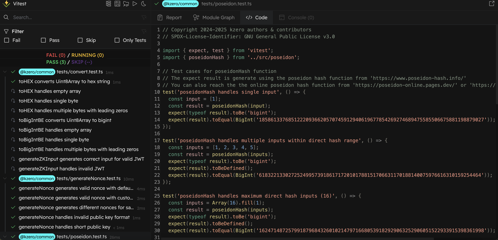

# Unit Test Documentation for @kzero/common


## 😄 Overview

This document outlines the unit testing plan and execution results for the [@kzero/common](https://github.com/kzero-xyz/kzero-service/tree/master/packages/common). This package provides common utilities and cryptographic functions for KZero services, responsible for transforming the user's JWT and secret inputs into a valid format for the Kzero zk-circuit.

## 🎯 Testing Objectives

- Ensure correctness of JWT parsing and validation.
- Verify proper handling and transformation of local user inputs.
- Validate correct generation of circuit-ready inputs (witness inputs).
- Detect edge cases and invalid inputs early through robust unit tests.
- Maintain high code coverage and long-term testability.


## 🛠️ Test Environment
- Node.js (>=20)
- TypeScript
- Yarn (v4.7.0)
- **Language:** TypeScript
- **Testing Framework:** Vitest(https://vitest.dev/)


## 🔧 Test Setup

```bash
yarn install
```

```bash
yarn test
yarn test:watch
yarn test:watch --ui
```

## ⛑️ Utils Under Test

### Poseidon Hasher
Responsible for:
- Computing a Poseidon hash of the input data
- Automatically performing the field-padding if needed

### Nonce Generator
Responsible for:
- Generating a cryptographic nonce for ZK-Login authentication(using the ephemeral public key and a maximum epoch time)

### Conversion Utilities(Converter)
Responsible for:
- Decoding the JWT header, payload and signature,
- Extracting required claims (e.g., sub, iss, aud)
- Converting JWT into zk-circuit desired structure,
- Conducting PoseidonHash using the JWT elements and user locally private data,
- Transforming the data into the format which is more suitable for hashing


## 📖 Test Cases

#### 1. Poseidon Hasher Tests (`poseidon.test.ts`)
- ✅ Single input handling
  - Verifies correct hash computation for single input
  - Validates output type as bigint
- ✅ Multiple inputs handling
  - Tests hash computation for multiple inputs (1-16 elements)
  - Validates output for inputs requiring recursive hashing
- ✅ Edge cases
  - Empty array Error handling
  - Maximum length validation (32 elements)
- ✅ Consistency checks
  - Same input produces same output
  - Different inputs produce different outputs
- ✅ Type handling
  - Supports string, number, and bigint inputs

#### 2. Nonce Generation Tests (`generateNonce.test.ts`)
- ✅ Basic functionality
  - Generates valid nonce with public key
  - Verifies nonce format and length
- ✅ Error handling
  - Invalid public key format
  - Empty public key
  - Non-hexadecimal public key
- ✅ Edge cases
  - Invalid Length of public key
- ✅ Consistency checks
  - Same input produces same output
  - Different inputs produce different outputs

#### 3. Conversion Utilities Tests (`convert.test.ts`)
- ✅ BigInt conversions
  - BigInt to hex string
  - Hex string to BigInt
- ✅ ZK Input generation
  - Valid input generation
  - Error handling for invalid inputs
- ✅ Edge cases
  - Empty string handling
  - Invalid format handling
  - Maximum value handling

> For more details about the test, please reach to @kzero/common(https://github.com/kzero-xyz/kzero-service/tree/master/packages/common).

## 📕 Test Report
## yarn test:watch
When running `yarn test:watch`, we can observe detailed test execution reports that provide insights into the test coverage and performance. Below is the report example:


```bash
RERUN  rerun all tests

 ✓  @kzero/common  tests/poseidon.test.ts (9 tests) 18ms
 ✓  @kzero/common  tests/generateNonce.test.ts (5 tests) 7ms
 ✓  @kzero/common  tests/convert.test.ts (10 tests) 16ms

 Test Files  3 passed (3)
      Tests  24 passed (24)
   Start at  17:26:18
   Duration  577ms

Coverage report from istanbul
```


File               | % Stmts | % Branch | % Funcs | % Lines | Uncovered Line #s
-------------------|---------|----------|---------|---------|-------------------
All files          |   57.44 |    18.64 |      40 |   56.53 |
 ...ges/common/src |   99.01 |      100 |   68.35 |      99 |
  convert.ts       |   98.93 |      100 |   69.33 |   98.93 | 752-753
  generateNonce.ts |     100 |      100 |      50 |     100 |
  poseidon.ts      |     100 |      100 |      50 |     100 |
 ...ges/logger/src |       0 |        0 |       0 |       0 |
  config.ts        |       0 |      100 |     100 |       0 | 6
  createLogger.ts  |       0 |        0 |       0 |       0 | 10-128
 ...oof-worker/src |       0 |        0 |       0 |       0 |
  ...cketClient.ts |       0 |        0 |       0 |       0 | 8-169
  dotenv.ts        |       0 |      100 |     100 |       0 | 6
  generateProof.ts |       0 |        0 |       0 |       0 | 13-84
  index.ts         |       0 |        0 |       0 |       0 | 15-86
  worker.ts        |       0 |        0 |       0 |       0 | 26-40
 ...rker/src/utils |       0 |      100 |     100 |       0 |
  logger.ts        |       0 |      100 |     100 |       0 | 9
 scripts           |       0 |      100 |       0 |       0 |
  clean.js         |       0 |      100 |       0 |       0 | 10-38

## yarn test:watch --ui

When running `yarn test:watch --ui`, you can launch an interactive UI that allows you to run individual tests. This provides a more visual and interactive testing experience, making it easier to focus on specific test cases during development.

The UI mode offers several advantages:
- Ability to selectively run individual test files or test cases
- Real-time test results with visual indicators
- Detailed error reporting with stack traces
- Easy navigation between test files


