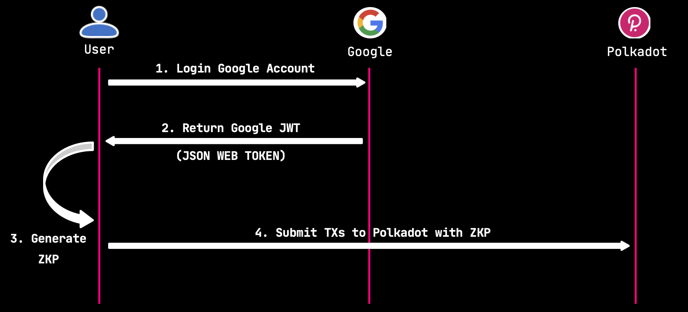

# 🚀🚀🚀  Quick Start: Seamless Integration of pallet-zklogin into Any Substrate Chain

## Introduction

This guide walks you through integrating the `pallet-zklogin` module into any Substrate-based relaychain or parachain. It is intended for blockchain engineers and runtime developers who want to enable OAuth-based zero-knowledge authentication & zkLogin transactions on their chain.
> Click [here](#-how-to-integrate-zklogin-) to see the process of integrating zkLogin into your chain.

## Core Components

### 1. ZkLogin Authentication System

The runtime integrates a custom `pallet-zklogin` that enables:
- **OAuth-based authentication** using zero-knowledge proofs
- **JWK (JSON Web Key) management** for verifying OAuth provider signatures
- **Ephemeral key verification** for secure transaction signing
- **Multi-provider support** including Google, Facebook, Twitch, Kakao, Apple, Slack, and GitHub



### 2. Account Recovery Mechanisms

The runtime implements two complementary account recovery models:

#### A. Proxy-based Recovery (`pallet-proxy`)
> More details about pallet-proxy : https://docs.openzeppelin.com/substrate-runtimes/1.0.0/pallets/proxy

**Purpose**: Provides immediate delegation capabilities for account management.

**Key Features**:
- **Direct delegation**: Account owners can delegate specific permissions to trusted parties
- **Flexible proxy types**: Supports different proxy types (Any, NonTransfer, Governance, Staking)
- **Immediate effect**: No waiting period required
- **Granular control**: Can specify delay periods and proxy types

**Use Cases**:
- Temporary account management delegation
- Multi-signature setups
- Governance participation through proxies
- Immediate access transfer

**Implementation**:
```rust
// Add proxy delegation
let proxy_call = pallet_proxy::Call::add_proxy {
    delegate: MultiAddress::Id(delegatee),
    proxy_type: (),
    delay: 0u32,
};

// Execute calls through proxy
let proxy_call = pallet_proxy::Call::proxy {
    real: MultiAddress::Id(delegator),
    force_proxy_type: None,
    call: Box::new(transfer_call),
};
```

#### B. Social Recovery (`pallet-recovery`)
> More details about pallet-recovery : https://github.com/paritytech/substrate/blob/master/frame/recovery/README.md

**Purpose**: Provides M-of-N social recovery for lost account access.

**Key Features**:
- **Social recovery**: Requires threshold number of friends to approve recovery
- **Configurable parameters**: 
  - `friends`: List of trusted recovery contacts
  - `threshold`: Minimum number of friends needed for recovery
  - `delay_period`: Waiting period before recovery can be claimed
- **Deposit-based security**: Requires deposits to prevent spam
- **Multi-step process**: Initiate → Vouch → Claim → Execute

**Recovery Flow**:
1. **Setup**: Account owner creates recovery configuration with friends and threshold
2. **Initiation**: Rescuer initiates recovery process
3. **Vouching**: Friends vouch for the recovery attempt
4. **Claiming**: Rescuer claims recovery after delay period
5. **Execution**: Rescuer can execute calls on behalf of recovered account

**Implementation**:
```rust
// Create recovery configuration
let create_recovery_call = pallet_recovery::Call::create_recovery {
    friends: friends.clone(),
    threshold,
    delay_period,
};

// Initiate recovery
let initiate_call = pallet_recovery::Call::initiate_recovery {
    account: MultiAddress::Id(lost_account),
};

// Vouch for recovery
let vouch_call = pallet_recovery::Call::vouch_recovery {
    lost: MultiAddress::Id(lost_account),
    rescuer: MultiAddress::Id(rescuer_account),
};

// Claim recovery
let claim_call = pallet_recovery::Call::claim_recovery {
    account: MultiAddress::Id(lost_account),
};

// Execute as recovered account
let as_recovered_call = pallet_recovery::Call::as_recovered {
    account: MultiAddress::Id(lost_account),
    call: Box::new(transfer_call),
};
```

## 🚀 How to integrate zkLogin ?
### Prerequisites
- Familiarity with Substrate runtime development
- A working Substrate node template or custom chain
- Rust toolchain and basic blockchain build/test environment

### Adding pallet-zklogin to Your Runtime

**Step 1: Add dependencies**
- In your runtime's `Cargo.toml`, add:
  ```toml
  [dependencies]
  pallet-zklogin = { git = "https://github.com/kzero-xyz/zklogin/...", branch = "main" }
  ```

**Step 2: Runtime lib.rs**
- Import the pallet and types:
  ```rust
  pub use pallet_zklogin;
  use pallet_zklogin::Call as ZkLoginCall;
  ```
- Ensure `pallet-zklogin` is included in your `construct_runtime!`: 
  ```rust
  construct_runtime!(
    ...
    ZkLogin: pallet_zklogin::{Pallet, Call, Storage, Event<T>},
    ...
  );
  ```

### Runtime Configuration

**📌Notice**
- You must create a new transaction type (referred to in this document as `InnerSignedExtra`). 
- In this new transaction type, you must carefully review the implementation of it. The implementation of `InnerSignedExtra` must not include any unsigned pre-dispatch logic, such as `checkWeight`. Other checks can remain consistent with the `SignedExtra` part in your runtime.


Implement the `pallet_zklogin::Config` trait for your runtime:
```rust
// For the inner transaction, we avoid the checkWeight
// When create the innerSignedPayload, we use the innerSignedExtra(which use the chargeTransactionPayment only)
pub type InnerSignedExtra = (
    frame_system::CheckNonZeroSender<Runtime>,
    frame_system::CheckSpecVersion<Runtime>,
    frame_system::CheckTxVersion<Runtime>,
    frame_system::CheckGenesis<Runtime>,
    frame_system::CheckEra<Runtime>,
    frame_system::CheckNonce<Runtime>,
    // avoid using CheckWeight in the inner part
    pallet_transaction_payment::ChargeTransactionPayment<Runtime>,
);

pub type InnerUncheckedExtrinsic = 
    generic::UncheckedExtrinsic<Address, RuntimeCall, Signature, InnerSignedExtra>;

// for inner transaction, we use the innerSignedPayload(which use the innerSignedExtra)
pub type InnerSignedPayload = generic::SignedPayload<RuntimeCall, InnerSignedExtra>;

impl pallet_zklogin::Config for Runtime {
    type AuthorityId = pallet_zklogin::crypto::ZkLoginAuthId;
    type MaxKeys = MaxKeys;
    type RuntimeEvent = RuntimeEvent;
    type Extrinsic = InnerUncheckedExtrinsic;
    type CheckedExtrinsic = <InnerUncheckedExtrinsic as sp_runtime::traits::Checkable<Self::Context>>::Checked;
    type UnsignedValidator = Runtime;
    type Context = frame_system::ChainContext<Runtime>;
    type Time = Timestamp;
    type WeightInfo = pallet_zklogin::weights::SubstrateWeight<Runtime>;
}
```

**For more details, see the pallet and primitive documentation, and refer to the test suite for integration examples.**


## 🚀 Integrate Recovery Mechnism for zkLogin Account

**zkLogin Account supports recovery functionality** : The zklogin pallet supports account recovery via two models: **Proxy-based Recovery** and **Social Recovery**. 
> To enable these features, you need to include both `pallet-proxy` and `pallet-recovery` in your runtime.

### Include Recovery pallet in your runtime
- Ensure `pallet-proxy`/`pallet-recovery` are included.
  ```rust
  // In construct_runtime!
    Proxy: pallet_proxy::{Pallet, Call, Storage, Event<T>},
    Recovery: pallet_recovery::{Pallet, Call, Storage, Event<T>},
  ```

## Usage Examples

### Submit zkLogin Transaction

```rust
// Construct InnerUncheckedExtrinsic(here, we construct a transfer call)
let call: RuntimeCall = BalancesCall::transfer_keep_alive { dest: MultiAddress::Id(dest), value: 100 }.into();

// ...
let inner_extra: InnerSignedExtra = ...;

let uxt = InnerUncheckedExtrinsic::new_signed(
    call,
    AccountId::from(signing_key).into(),
    MultiSignature::from(inner_sign),
    inner_extra,
);

let zklogin_call = pallet_zklogin::Call::submit_zklogin_unsigned {
    uxt: Box::new(uxt),
    address_seed: address_seed.into(),
    zk_material,
};

let outer_uxt = UncheckedExtrinsic::<
    MultiAddress<AccountId, ()>,
    RuntimeCall,
    MultiSignature,
    SignedExtra,
>::new_unsigned(zklogin_call.into());
```

### Setting up ZkLogin with Recovery

```rust
// 1. Create zkLogin account
let zk_account = generate_zk_address(oauth_provider, jwk);

// 2. Set up proxy recovery
let proxy_call = pallet_proxy::Call::add_proxy {
    delegate: MultiAddress::Id(trusted_account),
    proxy_type: ProxyType::Any,
    delay: 0,
};

// 3. Set up social recovery
let recovery_call = pallet_recovery::Call::create_recovery {
    friends: vec![friend1, friend2, friend3],
    threshold: 2,
    delay_period: 100,
};
```

### Recovery Scenarios

**Scenario 1: Immediate Access (Proxy)**
```rust
// Delegate immediately needs access
pallet_proxy::Pallet::<Runtime>::proxy(
    RawOrigin::Signed(delegate).into(),
    MultiAddress::Id(zk_account),
    None,
    Box::new(transfer_call),
);
```

**Scenario 2: Lost Access Recovery (Social)**
```rust
// 1. Initiate recovery
pallet_recovery::Pallet::<Runtime>::initiate_recovery(
    RawOrigin::Signed(rescuer).into(),
    MultiAddress::Id(lost_zk_account),
);

// 2. Friends vouch
pallet_recovery::Pallet::<Runtime>::vouch_recovery(
    RawOrigin::Signed(friend1).into(),
    MultiAddress::Id(lost_zk_account),
    MultiAddress::Id(rescuer),
);

// 3. Claim recovery
pallet_recovery::Pallet::<Runtime>::claim_recovery(
    RawOrigin::Signed(rescuer).into(),
    MultiAddress::Id(lost_zk_account),
);

// 4. Execute as recovered
pallet_recovery::Pallet::<Runtime>::as_recovered(
    RawOrigin::Signed(rescuer).into(),
    MultiAddress::Id(lost_zk_account),
    Box::new(transfer_call),
);
```

## Conclusion

The KZero runtime provides a comprehensive solution for secure blockchain authentication and account recovery. By combining zkLogin authentication with dual recovery mechanisms, it offers:

- **Secure authentication** through OAuth providers with zero-knowledge proofs
- **Flexible recovery options** through both proxy and social recovery
- **Robust security** with deposit requirements and delay periods
- **User-friendly experience** with familiar OAuth login flows

This architecture ensures that users can maintain control over their accounts while providing reliable recovery mechanisms for various scenarios. 

---

**For more details, see the runtime and primitive documentation, and refer to the test suite for integration examples.** 