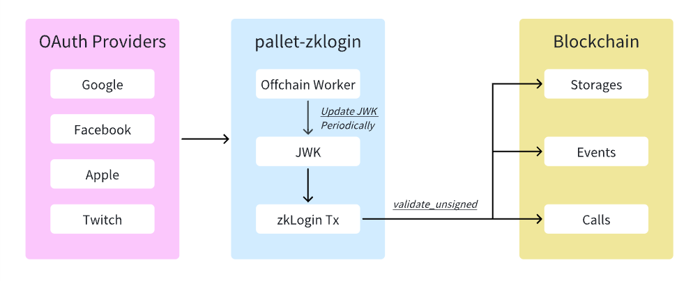

# Pallet ZkLogin: What & Why pallet-zklogin?
## Overview

Pallet ZkLogin is a Substrate-based blockchain pallet that enables Web3 applications to authenticate users using traditional OAuth providers (Google, Facebook, Apple, etc.) through zero-knowledge proof verification. This eliminates the need for users to manage private keys while maintaining blockchain security and privacy.

### Key Features
- **OAuth Integration**: Support for major OAuth providers (Google, Facebook, Apple, Twitch, Kakao, Slack, GitHub)
- **Zero-Knowledge Proofs**: Cryptographic verification without revealing user identity
- **Offchain Worker**: Automated JWK (JSON Web Key) management
- **Ephemeral Key Management**: Time-based key expiration for enhanced security
- **On-chain Verification**: ZK proofs are verified directly on the blockchain
- **Flexible Transaction Support**: Enables individualized transactions for various use cases, in the test, we use the `pallet-proxy` & `pallet-recovery` to implement the 'Proxy-based Recovery' and 'Social Recovery' for zkLogin Account.
---

## Architecture

### High-Level Architecture


### Component Interaction Flow


---

## Core Components

### 1. Pallet Structure
```rust
#[frame_support::pallet]
pub mod pallet {
    // Configuration trait
    #[pallet::config]
    pub trait Config: frame_system::Config + /* ... */ {
        type AuthorityId: AppCrypto<Self::Public, Self::Signature>;
        type MaxKeys: Get<u32>;
        type RuntimeEvent: From<Event<Self>>;
        type Context: Default;
        type Extrinsic: ExtrinsicExt<Call = Self::RuntimeCall> + /* ... */;
        type CheckedExtrinsic: Applyable<Call = Self::RuntimeCall> + /* ... */;
        type UnsignedValidator: ValidateUnsigned<Call = Self::RuntimeCall>;
        type Time: Time;
        type WeightInfo: WeightInfo;
    }
}
```

### 2. Storages
```rust
// Authorized keys for offchain operations
#[pallet::storage]
pub type Keys<T: Config> = StorageValue<_, WeakBoundedVec<T::Public, T::MaxKeys>, ValueQuery>;

// JWK storage by provider and key ID
#[pallet::storage]
pub(crate) type Jwks<T> = StorageDoubleMap<_, Twox64Concat, JwkProvider, Twox64Concat, Kid, Jwk>;
```

### 3. Events
```rust
#[pallet::event]
pub enum Event<T: Config> {
    ZkLoginExecuted { result: DispatchResult },
    JwksUpdated { provider: JwkProvider, jwks: Vec<Jwk> },
    Keys { keys: Vec<T::Public> },
}
```

### 4. Errors
```rust
#[pallet::error]
pub enum Error<T> {
    /// Ephemeral key is is expired.
    EphKeyExpired,
    /// Converted from Error `InvalidTransaction`
    /// No need to get any detailed error here.
    InvalidTransaction,
    /// Converted from Error `UnknownTransaction`
    UnknownTransactionCannotLookup,
    UnknownTransactionNoUnsignedValidator,
    UnknownTransactionCustom,
    /// Parse json to Jwk struct error.
    InvalidJwkJson,
}
```

---

## Key Methods & Functions

### 1. `validate_unsigned`
**Purpose**: Validates the validity of unsigned transactions to ensure only legitimate ZkLogin transactions can enter the transaction pool

> The `validate_unsigned` function is mainly being used in the context of the transaction pool to check the validity of the call wrapped by an unsigned extrinsic.
```rust
fn validate_unsigned(source: TransactionSource, call: &Self::Call) -> TransactionValidity
```

**Validation Steps**:
1. Extracts ZK material and ephemeral public key
2. Retrieves JWK from storage
3. Verifies ZK proof using JWK
4. Checks transaction validity

> 📌 **Notes**: When dealing with `submit_zklogin_unsigned` transactions, we need to rollback every status changes. Because the `validate_unsigned` should only do the check work, not do any thing related to the chain storage/status.
```rust
 #[pallet::validate_unsigned]
    // ...
    fn validate_unsigned(source: TransactionSource, call: &Self::Call) -> TransactionValidity {

    // verify signature
    match call {
        Call::submit_zklogin_unsigned { ... } => {
         // ...
            let r = with_transaction::<TransactionValidity, DispatchError, _>(|| {
                let result = xt.validate::<T::UnsignedValidator>(source, &dispatch_info, encoded_len);
                
                // must rollback for any case
                TransactionOutcome::Rollback(Ok(result))
            });
            // discard this part
            r.unwrap()
        }
        Call::submit_jwks_unsigned { ... } => { ... } 
    // ...
    }
```


### 2. `submit_zklogin_unsigned`
**Purpose**: Main entry point for ZkLogin transactions

**Trigger Condition**: When `validate_unsigned` passes, the transaction is included in a block

```rust
pub fn submit_zklogin_unsigned(
    origin: OriginFor<T>,
    uxt: Box<<T as Config>::Extrinsic>,
    address_seed: AccountIdLookupOf<T>,
    zk_material: ZkMaterial<MomentOf<T>>,
) -> DispatchResultWithPostInfo
```


### 3. `submit_jwks_unsigned`
**Purpose**: Updates JWK (JSON Web Key) sets from OAuth providers via offchain worker

**Trigger Condition**: Called by offchain worker when new/changed JWKs are detected

```rust
pub fn submit_jwks_unsigned(
    origin: OriginFor<T>,
    payload: JwksPayload<T::Public, BlockNumberFor<T>>,
    _signature: T::Signature,
) -> DispatchResultWithPostInfo
```

**Flow**:
1. Iterates through JWK providers and their key sets
2. Calls `insert_jwks` for each provider with `delete_before_insert = true`
3. Expects successful insertion (JWKs pre-validated by offchain worker)

### 4. `update_keys`
**Purpose**: Manages authorized keys for offchain worker operations

**Trigger Condition**: Called by root/admin to add/remove authorized keys
> 📌 Notice: This function is `Operational`.
```rust
pub fn update_keys(
    origin: OriginFor<T>,
    keys: Vec<(T::Public, bool)>,
) -> DispatchResultWithPostInfo
```

**Flow**:
1. Verifies root origin
2. Gets current authorized keys from storage
3. Processes each key operation (insert/delete)
4. Updates storage with new key set
5. Emits `Keys` event with updated key list

### 5. `set_jwk`
**Purpose**: Manually sets a single JWK for a specific provider

**Trigger Condition**: Called by root/admin for manual JWK management
> 📌 Notice: This function is `Operational`.

```rust
pub fn set_jwk(
    origin: OriginFor<T>,
    provider: JwkProvider,
    json: Vec<u8>,
) -> DispatchResultWithPostInfo
```

**Flow**:
1. Verifies root origin
2. Parses JSON into JWK structure
3. Calls `insert_jwks` with `delete_before_insert = false`
4. Returns success or parsing error


---

## Configuration & Setup

### Runtime Configuration
- **InnerSignedExtra** : Similar to `SignedExtra`, but it is used for constructing the inner calls(e.g. `pallet_balances::Call::transfer_keep_alive`, `pallet_recovery::Call::create_recovery`, ...), `InnerSignedExtra` should be used for the inner call, which doesn't contains the `CheckWeight`.

```rust
// For the inner transaction, we avoid the checkWeight, only do the charge
// When create the innerSignedPayload, we use the innerSignedExtra(which use the chargeTransactionPayment only)
pub type InnerSignedExtra = (
    frame_system::CheckNonZeroSender<Runtime>,
    frame_system::CheckSpecVersion<Runtime>,
    frame_system::CheckTxVersion<Runtime>,
    frame_system::CheckGenesis<Runtime>,
    frame_system::CheckEra<Runtime>,
    frame_system::CheckNonce<Runtime>,
    pallet_transaction_payment::ChargeTransactionPayment<Runtime>,
);

pub type InnerUncheckedExtrinsic = 
    generic::UncheckedExtrinsic<Address, RuntimeCall, Signature, InnerSignedExtra>;

// for inner transaction, we use the innerSignedPayload(which use the innerSignedExtra)
pub type InnerSignedPayload = generic::SignedPayload<RuntimeCall, InnerSignedExtra>;

impl pallet_zklogin::Config for Runtime {
    type AuthorityId = pallet_zklogin::crypto::ZkLoginAuthId;
    type MaxKeys = MaxKeys;
    type RuntimeEvent = RuntimeEvent;
    type Extrinsic = InnerUncheckedExtrinsic;
    type CheckedExtrinsic =
        <InnerUncheckedExtrinsic as sp_runtime::traits::Checkable<Self::Context>>::Checked;
    type UnsignedValidator = Runtime;
    type Context = frame_system::ChainContext<Runtime>;
    type Time = Timestamp;
    type WeightInfo = pallet_zklogin::weights::SubstrateWeight<Runtime>;
}
```

### OAuth Provider Configuration
Supported providers and their JWK endpoints:
- **Google**: `https://accounts.google.com/.well-known/openid-configuration`
- **Facebook**: `https://www.facebook.com/.well-known/openid-configuration/`
- **Apple**: `https://appleid.apple.com/.well-known/openid-configuration`
- **Twitch**: `https://id.twitch.tv/oauth2/.well-known/openid-configuration`
- **Kakao**: `https://kauth.kakao.com/.well-known/openid-configuration`
- **Slack**: `https://slack.com/.well-known/openid-configuration`
- **GitHub**: `https://token.actions.githubusercontent.com/.well-known/openid-configuration`

### Recovery Features

The zklogin pallet supports account recovery via two models: **Proxy-based Recovery** and **Social Recovery**. To enable these features, you need to include both `pallet-proxy` and `pallet-recovery` in your runtime.

#### Integration Steps
1. **Add Dependencies**
   - Ensure your runtime includes `pallet-proxy` and `pallet-recovery`:
     ```rust
     construct_runtime!(
         pub enum Runtime {
             // ...
             Proxy: pallet_proxy::{Pallet, Call, Storage, Event<T>},
             Recovery: pallet_recovery::{Pallet, Call, Storage, Event<T>},
             ZkLogin: pallet_zklogin::{Pallet, Call, Event<T>, ValidateUnsigned},
             // ...
         }
     );
     ```
2. **Configure the Pallets**
   - Implement the required `Config` traits for both pallets in your runtime, e.g.:
     ```rust
     impl pallet_proxy::Config for Runtime { /* ... */ }
     impl pallet_recovery::Config for Runtime { /* ... */ }
     ```

#### Recovery Models
- **Proxy-based Recovery**: The zkLogin account adds a proxy (another account) that can act on its behalf. If the user loses access, the proxy can help recover control.
- **Social Recovery**: The zkLogin account sets a group of trusted friends and a threshold. If the user loses access, a subset of friends (meeting the threshold) can vouch for recovery, and a rescuer can claim the account.

#### Example: Social Recovery Flow
1. **Create Recovery Config (as zkLogin user):**
   ```rust
   // zkLogin signs and submits:
   pallet_recovery::Call::create_recovery {
       friends: vec![friend1, friend2, friend3],
       threshold: 2,
       delay_period: 0,
   }
   // ...wrapped in zkLogin unsigned extrinsic
   ```
2. **Initiate Recovery (rescuer):**
   ```rust
   pallet_recovery::Call::initiate_recovery {
       account: lost_account,
   }
   ```
3. **Friends Vouch:**
   ```rust
   // Each friend signs and submits this call
   pallet_recovery::Call::vouch_recovery {
       lost: lost_account,
       rescuer: rescuer_account,
   }
   ```
4. **Claim Recovery (rescuer):**
   ```rust
   pallet_recovery::Call::claim_recovery {
       account: lost_account,
   }
   ```
5. **As Recovered (rescuer):**
   ```rust
   pallet_recovery::Call::as_recovered {
       account: lost_account,
       call: Box::new(pallet_balances::Call::transfer_keep_alive { dest, value }),
   }
   ```

#### Example: Proxy-based Recovery
1. **Add Proxy (as zkLogin user):**
   ```rust
   pallet_proxy::Call::add_proxy {
       delegate: proxy_account,
       proxy_type: (),
       delay: 0,
   }
   // ...wrapped in zkLogin unsigned extrinsic
   ```
2. **Proxy Executes Recovery or Transfer:**
   - The proxy can now submit transactions on behalf of the zkLogin account.

> All these calls can be wrapped and submitted via zkLogin unsigned extrinsics, enabling seamless recovery flows for users authenticated via OAuth and ZK proofs.

---

## Testing

### Test Coverage Overview

The zklogin pallet includes a comprehensive suite of unit and integration tests, covering the following areas:

- **Basic Initialization**
  - `basic_setup_works`: Ensures the test environment and initial balances are set up correctly.

- **ZKLogin Transaction Flow**
  - `validate_unsigned_should_work`: Validates a successful zkLogin unsigned transaction, including proof verification, JWK setup, and balance transfer.
  - `validate_unsigned_should_fail_when_jwk_not_match`: Ensures that transactions with mismatched JWKs are rejected.
  - `test_submit_zklogin_unsigned`: Tests the full unsigned zkLogin transaction submission and execution.

- **JWK and Key Management**
  - `test_parse_jwk_success`, `test_parse_jwk_with_google_format`: Validate correct parsing of JWK JSON.
  - `test_parse_jwk_missing_required_fields`: Ensures invalid or incomplete JWKs are rejected.
  - `test_set_jwk`: Tests manual JWK setting, including root access control and error handling.
  - `test_update_keys`: Verifies adding/removing authorized keys and root-only access.
  - `test_submit_jwks_unsigned`: Tests offchain worker JWK batch submission and signature verification.
  - `test_fetch_jwks`: Mocks HTTP to test offchain JWK fetching.
  - `test_check_jwk_not_onchain_when_not_exists`, `test_check_jwk_not_onchain_when_same_content`, `test_check_jwk_not_onchain_when_different_content`: Test on-chain/off-chain JWK comparison logic.

- **Proxy and Recovery Flows**
  - `validate_add_proxy_should_work`, `validate_proxy_call_should_work`, `validate_remove_proxy_should_work`: Test proxy addition, proxy call execution, and proxy removal via zkLogin.
  - `validate_create_recovery_should_work`, `validate_complete_recovery_flow_should_work`: Test social recovery setup and the full recovery process, including friend vouching and fund recovery.

- **Weight Consistency**
  - `should_weight_the_same`: Ensures that zkLogin-wrapped calls have the same weight as direct calls.

### Running the Tests

To run all tests:
```bash
cd frame/zklogin
cargo test
```

All tests should pass, covering the full zkLogin, JWK, proxy, and recovery flows, as well as error and edge cases.

---

## Benchmark
### Benchmark Functions
#### 1. `submit_jwks_unsigned`
**Purpose**: Measures performance of JWK batch submission by offchain worker

**Scope**: Batch JWK processing, signature verification, storage updates

**Setup Process**:
- Generates dynamic number of JWKs based on complexity parameter `c`
- Creates authorized public key for signing
- Constructs JwksPayload with provider and JWK data
- Signs payload using ed25519 cryptography
- Prepares unsigned transaction with signature

**Key Measurements**:
- JWK parsing and validation time
- Batch storage insertion performance
- Signature verification overhead
- Event emission for multiple JWKs
- Storage prefix clearing operations

**Complexity Factors**:
- Number of JWKs in batch (0-10)
- JWK size and structure complexity
- Storage operation batch size
- Signature verification cost

---

#### 2. `update_keys`
**Purpose**: Measures performance of authorized key management operations

**Scope**: Key addition/removal, storage updates, access control

**Setup Process**:
- Generates test keys based on complexity parameter `c`
- Creates key operation tuples (public_key, insert_or_delete)
- Prepares root origin for administrative access

**Key Measurements**:
- Key storage read/write operations
- Vector manipulation performance
- Storage value updates
- Event emission for key changes
- Access control verification

**Complexity Factors**:
- Number of key operations (0-10)
- Storage vector size changes
- Key comparison operations
- Event data size

---


#### 3. `set_jwk`
**Purpose**: Measures performance of manual JWK setting by root

**Scope**: JWK parsing, storage insertion, access control

**Setup Process**:
- Uses predefined JWK JSON from benchmark data
- Sets up Google provider configuration
- Prepares root origin for administrative access
- Converts JSON to byte vector

**Key Measurements**:
- JWK JSON parsing time
- Storage insertion performance
- Access control verification
- Event emission cost
- Error handling overhead

**Complexity Factors**:
- JWK JSON size and complexity
- Storage operation cost
- JSON parsing efficiency
- Event emission overhead

### Benchmark Data Management

- BenchmarkZkMaterial: Provides consistent test data for ZK proof verification
- BenchmarkJwks: Provides test JWK data for various scenarios
- BenchmarkKeys: Provides test key related data for authorization scenarios


## Running Benchmark 
- First, compile.
```bash
cargo build --package node-template --release --features "primitive-zklogin/testing runtime-benchmarks"
```

- Second, run the benchmark. After running the benchmark, you will see the weight updated at the `frame/zklogin/src/newWeight.rs`. 
> You can just copy the new weight and paste the weight part(start from Line 57) to the `weight.rs` file 
```bash
./target/release/node-template benchmark pallet \
--chain dev \
--pallet pallet_zklogin \
--extrinsic '*' \
--steps 50 \
--repeat 20 \
--output frame/zklogin/src/newWeight.rs
# --output frame/zklogin/src/weights.rs
```
---

## Security Considerations

### 1. Ephemeral Key Security
- **Time-based Expiration**: Ephemeral keys have limited lifetime
- **Single Use**: Each key should be used only once
- **Random Generation**: Keys must be cryptographically random

### 2. JWK Management
- **Source Verification**: JWKs must come from trusted OAuth providers
- **Regular Updates**: Offchain worker ensures JWK freshness
- **Storage Security**: JWKs stored securely on-chain

### 3. ZK Proof Verification
- **Cryptographic Security**: Uses Groth16 SNARK with trusted setup
- **Input Validation**: All public inputs must be verified
- **Proof Freshness**: Proofs must be recent and valid

### 4. Access Control
- **Key Authorization**: Only authorized keys can update JWKs
- **Transaction Validation**: All transactions validated before execution
- **Error Handling**: Proper error responses prevent information leakage

---

## Conclusion

Pallet ZkLogin provides a secure and user-friendly way to integrate traditional OAuth authentication with blockchain applications. By leveraging zero-knowledge proofs, it maintains user privacy while enabling seamless Web3 experiences.

### Key Benefits
- ✅ **User-Friendly**: No private key management required
- ✅ **Secure**: Zero-knowledge proof verification
- ✅ **Scalable**: Support for multiple OAuth providers
- ✅ **Automated**: Offchain worker for JWK management
- ✅ **Compliant**: Works with existing identity systems

### Future Enhancements
- Additional OAuth provider support
- Enhanced ZK proof schemes
- Improved performance optimizations
- Advanced security features

---

*For more information, visit the [KZero GitHub repository](https://github.com/kzero-xyz/kzero) or contact the development team.* 