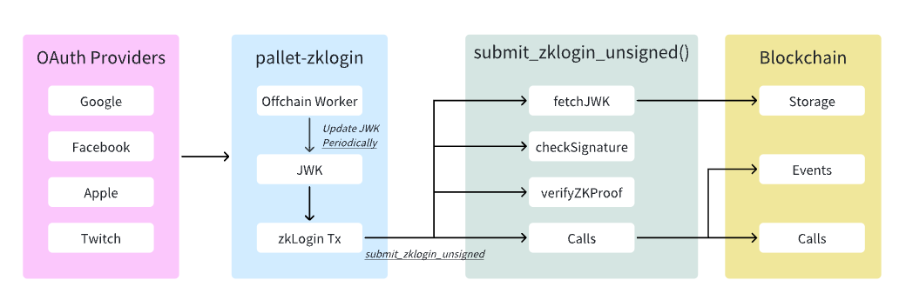

# Pallet ZkLogin: What & Why pallet-zklogin?

## Table of Contents
1. [Overview](#overview)
2. [Architecture](#architecture)
4. [Core Components](#core-components)
5. [Key Methods & Functions](#key-methods--functions)
6. [Configuration & Setup](#configuration--setup)
7. [Testing](#testing)
8. [Running Tests](#running-tests)
9. [Benchmark](#benchmark)
10.[Running Benchmark](#running-benchmark)
11. [Security Considerations](#security-considerations)
12. [Conclusion](#conclusion)
---

## Overview

Pallet ZkLogin is a Substrate-based blockchain pallet that enables Web3 applications to authenticate users using traditional OAuth providers (Google, Facebook, Apple, etc.) through zero-knowledge proof verification. This eliminates the need for users to manage private keys while maintaining blockchain security and privacy.

### Key Features
- **OAuth Integration**: Support for major OAuth providers (Google, Facebook, Apple, Twitch, Kakao, Slack, GitHub)
- **Zero-Knowledge Proofs**: Cryptographic verification without revealing user identity
- **Offchain Worker**: Automated JWK (JSON Web Key) management
- **Ephemeral Key Management**: Time-based key expiration for enhanced security
- **On-chain Verification**: ZK proofs are verified directly on the blockchain
- **Flexible Transaction Support**: Enables individualized transactions for various use cases
---

## Architecture

### High-Level Architecture


### Component Interaction Flow


---

## Core Components

### 1. Pallet Structure
```rust
#[frame_support::pallet]
pub mod pallet {
    // Configuration trait
    #[pallet::config]
    pub trait Config: frame_system::Config + /* ... */ {
        type AuthorityId: AppCrypto<Self::Public, Self::Signature>;
        type MaxKeys: Get<u32>;
        type RuntimeEvent: From<Event<Self>>;
        type Context: Default;
        type Extrinsic: ExtrinsicExt<Call = Self::RuntimeCall> + /* ... */;
        type CheckedExtrinsic: Applyable<Call = Self::RuntimeCall> + /* ... */;
        type UnsignedValidator: ValidateUnsigned<Call = Self::RuntimeCall>;
        type Time: Time;
        type WeightInfo: WeightInfo;
    }
}
```

### 2. Storages
```rust
// Authorized keys for offchain operations
#[pallet::storage]
pub type Keys<T: Config> = StorageValue<_, WeakBoundedVec<T::Public, T::MaxKeys>, ValueQuery>;

// JWK storage by provider and key ID
#[pallet::storage]
pub(crate) type Jwks<T> = StorageDoubleMap<_, Twox64Concat, JwkProvider, Twox64Concat, Kid, Jwk>;
```

### 3. Events
```rust
#[pallet::event]
pub enum Event<T: Config> {
    ZkLoginExecuted { result: DispatchResult },
    JwksUpdated { provider: JwkProvider, jwks: Vec<Jwk> },
    Keys { keys: Vec<T::Public> },
}
```

### 4. Errors
```rust
#[pallet::error]
pub enum Error<T> {
    /// Ephemeral key is is expired.
    EphKeyExpired,
    /// Converted from Error `InvalidTransaction`
    /// No need to get any detailed error here.
    InvalidTransaction,
    /// Converted from Error `UnknownTransaction`
    UnknownTransactionCannotLookup,
    UnknownTransactionNoUnsignedValidator,
    UnknownTransactionCustom,
    /// Parse json to Jwk struct error.
    InvalidJwkJson,
}
```

---

## Key Methods & Functions

### 1. `validate_unsigned`
**Purpose**: Validates the validity of unsigned transactions to ensure only legitimate ZkLogin transactions can enter the transaction pool

```rust
fn validate_unsigned(source: TransactionSource, call: &Self::Call) -> TransactionValidity
```

**Validation Steps**:
1. Extracts ZK material and ephemeral public key
2. Retrieves JWK from storage
3. Verifies ZK proof using JWK
4. Checks transaction validity
> The `validate_unsigned` function is mainly being used in the context of the transaction pool to check the validity of the call wrapped by an unsigned extrinsic.


### 2. `submit_zklogin_unsigned`
**Purpose**: Main entry point for ZkLogin transactions

**Trigger Condition**: When `validate_unsigned` passes, the transaction is included in a block

**Execution Location**: During block execution phase

```rust
pub fn submit_zklogin_unsigned(
    origin: OriginFor<T>,
    uxt: Box<<T as Config>::Extrinsic>,
    address_seed: AccountIdLookupOf<T>,
    zk_material: ZkMaterial<MomentOf<T>>,
) -> DispatchResultWithPostInfo
```


### 3. `submit_jwks_unsigned`
**Purpose**: Updates JWK (JSON Web Key) sets from OAuth providers via offchain worker

**Trigger Condition**: Called by offchain worker when new/changed JWKs are detected

```rust
pub fn submit_jwks_unsigned(
    origin: OriginFor<T>,
    payload: JwksPayload<T::Public, BlockNumberFor<T>>,
    _signature: T::Signature,
) -> DispatchResultWithPostInfo
```

**Flow**:
1. Iterates through JWK providers and their key sets
2. Calls `insert_jwks` for each provider with `delete_before_insert = true`
3. Expects successful insertion (JWKs pre-validated by offchain worker)

### 4. `update_keys`
**Purpose**: Manages authorized keys for offchain worker operations

**Trigger Condition**: Called by root/admin to add/remove authorized keys
> 📌 Notice: This function is `Operational`.
```rust
pub fn update_keys(
    origin: OriginFor<T>,
    keys: Vec<(T::Public, bool)>,
) -> DispatchResultWithPostInfo
```

**Flow**:
1. Verifies root origin
2. Gets current authorized keys from storage
3. Processes each key operation (insert/delete)
4. Updates storage with new key set
5. Emits `Keys` event with updated key list

### 5. `set_jwk`
**Purpose**: Manually sets a single JWK for a specific provider

**Trigger Condition**: Called by root/admin for manual JWK management
> 📌 Notice: This function is `Operational`.

```rust
pub fn set_jwk(
    origin: OriginFor<T>,
    provider: JwkProvider,
    json: Vec<u8>,
) -> DispatchResultWithPostInfo
```

**Flow**:
1. Verifies root origin
2. Parses JSON into JWK structure
3. Calls `insert_jwks` with `delete_before_insert = false`
4. Returns success or parsing error


---

## Configuration & Setup

### Runtime Configuration
```rust
impl pallet_zklogin::Config for Runtime {
    type AuthorityId = pallet_zklogin::crypto::ZkLoginAuthId;
    type RuntimeEvent = RuntimeEvent;
    type Context = ();
    type Extrinsic = UncheckedExtrinsic;
    type CheckedExtrinsic = CheckedExtrinsic;
    type UnsignedValidator = Pallet<Runtime>;
    type Time = Timestamp;
    type MaxKeys = ConstU32<3>;
    type WeightInfo = pallet_zklogin::weights::SubstrateWeight<Runtime>;
}
```


### OAuth Provider Configuration
Supported providers and their JWK endpoints:
- **Google**: `https://accounts.google.com/.well-known/openid-configuration`
- **Facebook**: `https://www.facebook.com/.well-known/openid-configuration/`
- **Apple**: `https://appleid.apple.com/.well-known/openid-configuration`
- **Twitch**: `https://id.twitch.tv/oauth2/.well-known/openid-configuration`
- **Kakao**: `https://kauth.kakao.com/.well-known/openid-configuration`
- **Slack**: `https://slack.com/.well-known/openid-configuration`
- **GitHub**: `https://token.actions.githubusercontent.com/.well-known/openid-configuration`

---

## Testing

### Key Unit Tests & Functions
#### 1. `basic_setup_works`
**Purpose**: Verifies basic pallet setup and account initialization

**Test Scope**: Storage initialization, account balance setup

**What it tests**:
- Test externalities are properly set up
- ZkLogin address has expected initial balance
- Storage items are initialized with default values
- Pallet can be accessed and queried

**Key Assertions**:
- System account balance matches expected value
- Keys storage is empty initially
- Jwks storage is empty initially

---

#### 2. `validate_unsigned_should_work`
**Purpose**: Tests ZK proof validation in unsigned transaction processing

**Test Scope**: ZK proof verification, JWK validation, transaction validity

**What it tests**:
- ZK proof validation
- JWK retrieval from storage
- Ephemeral key signature verification
- Transaction source validation
- Address lookup functionality
- Complete unsigned transaction flow

**Test Setup**:
- Creates test ZK material with Google provider
- Generates ephemeral key pair
- Constructs balance transfer transaction
- Inserts valid JWK into storage

**Key Assertions**:
- Validation returns `Ok(ValidTransaction)`
- All cryptographic verifications pass
- Transaction is marked as valid for inclusion

---

#### 3. `validate_unsigned_should_fail_when_jwk_not_match`
**Purpose**: Tests validation failure when JWK doesn't match expected format
**Test Scope**: Error handling, invalid JWK scenarios

**What it tests**:
- JWK mismatch detection
- Error propagation in validation

**Test Setup**:
- Uses different JWK than what ZK proof was generated with
- Inserts mismatched JWK into storage
- Attempts validation with incorrect material

**Key Assertions**:
- Validation returns `Err(InvalidTransaction)`
- Proper error type is propagated

---

#### 4. `test_parse_jwk_success`
**Purpose**: Tests successful JWK parsing from JSON format

**Test Scope**: JWK parsing, JSON deserialization

**What it tests**:
- JWK JSON parsing functionality
- Required field extraction
- Error handling for valid input
- JWK structure validation

**Test Data**:
- Valid Google JWK JSON with all required fields
- Proper RSA key structure
- Correct key ID and algorithm specifications

**Key Assertions**:
- Parsing returns `Ok(Jwk)`
- All required fields are correctly extracted
- JWK structure matches expected format

---

#### 5. `test_parse_jwk_missing_required_fields`
**Purpose**: Tests JWK parsing failure when required fields are missing

**Test Scope**: Error handling, invalid JSON format

**What it tests**:
- Missing required field detection
- JSON validation error handling
- Proper error type propagation
- Invalid input rejection

**Test Data**:
- Invalid JWK JSON missing key fields (kid, alg, n, e)
- Malformed JSON structure

**Key Assertions**:
- Parsing returns `Err(InvalidJwkJson)`
- Correct error type is returned
- Invalid input is properly rejected

---

#### 6. `test_fetch_jwks`
**Purpose**: Tests JWK fetching from OAuth providers(via mocking the HTTP)

**Test Scope**: HTTP requests, provider integration

**What it tests**:
- JWK URI extraction and validation
- JWK set parsing and deserialization
- Multiple JWK handling
- Error handling for network failures

**Test Setup**:
- Mocks HTTP responses for well-known and JWK endpoints
- Tests Google provider integration
- Simulates complete JWK fetching flow

**Key Assertions**:
- JWK fetching returns `Ok(Vec<Jwk>)`
- Correct number of JWKs are parsed
- Key IDs match expected values
- Provider integration works correctly

---

#### 7. `test_check_jwk_not_onchain`
**Purpose**: Tests JWK comparison logic between offchain and onchain data

**Test Scope**: Storage comparison, update detection

**Test Scenarios**:
- **JWK not exists**: Returns `Some(true)` - needs upload
- **Same content**: Returns `Some(false)` - no update needed  
- **Different content**: Returns `Some(true)` - needs update

**What it tests**:
- JWK existence checking
- Content comparison logic
- Update requirement detection
- Storage state validation

**Key Assertions**:
- Correct update flags are returned
- Content comparison works accurately
- Storage state is properly evaluated

---

#### 8. `test_set_jwk`
**Purpose**: Tests manual JWK setting functionality

**Test Scope**: Root access control, JWK insertion

**What it tests**:
- Root access control enforcement
- JWK parsing and storage
- Error handling for unauthorized access
- Storage verification

**Test Scenarios**:
- **Root access**: Successfully sets JWK
- **Non-root access**: Fails with authorization error
- **Invalid JSON**: Fails with parsing error

**Key Assertions**:
- Root can successfully set JWK
- Non-root access is properly rejected
- JWK is correctly stored in storage
- Events are properly emitted

---

#### 9. `test_update_keys`
**Purpose**: Tests authorized key management functionality

**Test Scope**: Key addition/removal, storage updates

**What it tests**:
- Key addition functionality
- Key removal functionality
- Root access control
- Storage state management
- Event emission verification

**Test Scenarios**:
- **Add keys**: Successfully adds new authorized keys
- **Remove keys**: Successfully removes existing keys
- **Mixed operations**: Add and remove keys in same call
- **Non-root access**: Fails with authorization error

**Key Assertions**:
- Keys are correctly added to storage
- Keys are correctly removed from storage
- Storage state is properly updated
- Events contain correct key information
- Root access control is enforced

---

#### 10. `test_submit_jwks_unsigned`
**Purpose**: Tests offchain worker JWK submission

**Test Scope**: Unsigned transaction processing, signature verification

**What it tests**:
- Unsigned transaction validation
- Authorized key signature verification
- JWK batch insertion
- Event emission

**Test Setup**:
- Creates authorized key pair
- Generates signed payload with JWK data
- Submits unsigned transaction with signature

**Key Assertions**:
- Transaction is accepted with valid signature
- JWKs are correctly stored in batch
- Events are properly emitted
- Invalid signatures are rejected

---

## Running Tests
```bash
# Run all tests
cd frame/zklogin

cargo test

# Run specific test
cargo test validate_unsigned_should_work
```
After successfully running the test, you should get the following result:
```bash
running 16 tests
test tests::test_parse_jwk_missing_required_fields ... ok
test tests::test_check_jwk_not_onchain_when_different_content ... ok
test tests::test_check_jwk_not_onchain_when_not_exists ... ok
test tests::test_check_jwk_not_onchain_when_same_content ... ok
test tests::test_parse_jwk_success ... ok
test tests::test_parse_jwk_with_google_format ... ok
test tests::__construct_runtime_integrity_test::runtime_integrity_tests ... ok
test tests::test_genesis_config_builds ... ok
test tests::test_fetch_jwks ... ok
test tests::test_update_keys ... ok
test tests::test_submit_jwks_unsigned ... ok
test tests::test_set_jwk ... ok
test tests::validate_unsigned_should_fail_when_jwk_not_match ... ok
test tests::basic_setup_works ... ok
test tests::test_submit_zklogin_unsigned ... ok
test tests::validate_unsigned_should_work ... ok

test result: ok. 16 passed; 0 failed; 0 ignored; 0 measured; 0 filtered out; finished in 29.16s

   Doc-tests pallet_zklogin
```


## Benchmark
### Benchmark Functions
#### 1. `submit_zklogin_unsigned`
**Purpose**: Measures performance of ZkLogin unsigned transaction submission

**Scope**: ZK proof verification, transaction execution, storage operations

**Setup Process**:
- Creates test ZK material with predefined cryptographic data
- Generates ephemeral key pair and signature
- Sets up account balances for gas payment
- Constructs system remark call as test transaction
- Prepares unchecked extrinsic with proper signed extras

**Key Measurements**:
- ZK proof verification time
- Transaction validation overhead
- Storage read/write operations
- Event emission cost
- Executive transaction execution time

**Complexity Factors**:
- ZK proof size and verification complexity
- Transaction payload size
- Storage access patterns
- Cryptographic operation costs

---

#### 2. `submit_jwks_unsigned`
**Purpose**: Measures performance of JWK batch submission by offchain worker

**Scope**: Batch JWK processing, signature verification, storage updates

**Setup Process**:
- Generates dynamic number of JWKs based on complexity parameter `c`
- Creates authorized public key for signing
- Constructs JwksPayload with provider and JWK data
- Signs payload using ed25519 cryptography
- Prepares unsigned transaction with signature

**Key Measurements**:
- JWK parsing and validation time
- Batch storage insertion performance
- Signature verification overhead
- Event emission for multiple JWKs
- Storage prefix clearing operations

**Complexity Factors**:
- Number of JWKs in batch (0-10)
- JWK size and structure complexity
- Storage operation batch size
- Signature verification cost

---

#### 3. `update_keys`
**Purpose**: Measures performance of authorized key management operations

**Scope**: Key addition/removal, storage updates, access control

**Setup Process**:
- Generates test keys based on complexity parameter `c`
- Creates key operation tuples (public_key, insert_or_delete)
- Prepares root origin for administrative access

**Key Measurements**:
- Key storage read/write operations
- Vector manipulation performance
- Storage value updates
- Event emission for key changes
- Access control verification

**Complexity Factors**:
- Number of key operations (0-10)
- Storage vector size changes
- Key comparison operations
- Event data size

---


#### 4. `set_jwk`
**Purpose**: Measures performance of manual JWK setting by root

**Scope**: JWK parsing, storage insertion, access control

**Setup Process**:
- Uses predefined JWK JSON from benchmark data
- Sets up Google provider configuration
- Prepares root origin for administrative access
- Converts JSON to byte vector

**Key Measurements**:
- JWK JSON parsing time
- Storage insertion performance
- Access control verification
- Event emission cost
- Error handling overhead

**Complexity Factors**:
- JWK JSON size and complexity
- Storage operation cost
- JSON parsing efficiency
- Event emission overhead

### Benchmark Data Management

- BenchmarkZkMaterial: Provides consistent test data for ZK proof verification
- BenchmarkJwks: Provides test JWK data for various scenarios
- BenchmarkKeys: Provides test key related data for authorization scenarios


## Running Benchmark 
- First, compile.
```bash
cargo build --package node-template --release --features "primitive-zklogin/testing runtime-benchmarks"
```

- Second, run the benchmark. After running the benchmark, you will see the weight updated at the `frame/zklogin/src/newWeight.rs`. 
> You can just copy the new weight and paste the weight part(start from Line 57) to the `weight.rs` file 
```bash
./target/release/node-template benchmark pallet \
--chain dev \
--pallet pallet_zklogin \
--extrinsic '*' \
--steps 50 \
--repeat 20 \
--output frame/zklogin/src/newWeight.rs
# --output frame/zklogin/src/weights.rs
```
---

## Security Considerations

### 1. Ephemeral Key Security
- **Time-based Expiration**: Ephemeral keys have limited lifetime
- **Single Use**: Each key should be used only once
- **Random Generation**: Keys must be cryptographically random

### 2. JWK Management
- **Source Verification**: JWKs must come from trusted OAuth providers
- **Regular Updates**: Offchain worker ensures JWK freshness
- **Storage Security**: JWKs stored securely on-chain

### 3. ZK Proof Verification
- **Cryptographic Security**: Uses Groth16 SNARK with trusted setup
- **Input Validation**: All public inputs must be verified
- **Proof Freshness**: Proofs must be recent and valid

### 4. Access Control
- **Key Authorization**: Only authorized keys can update JWKs
- **Transaction Validation**: All transactions validated before execution
- **Error Handling**: Proper error responses prevent information leakage

---

## Conclusion

Pallet ZkLogin provides a secure and user-friendly way to integrate traditional OAuth authentication with blockchain applications. By leveraging zero-knowledge proofs, it maintains user privacy while enabling seamless Web3 experiences.

### Key Benefits
- ✅ **User-Friendly**: No private key management required
- ✅ **Secure**: Zero-knowledge proof verification
- ✅ **Scalable**: Support for multiple OAuth providers
- ✅ **Automated**: Offchain worker for JWK management
- ✅ **Compliant**: Works with existing identity systems

### Future Enhancements
- Additional OAuth provider support
- Enhanced ZK proof schemes
- Improved performance optimizations
- Advanced security features

---

*For more information, visit the [KZero GitHub repository](https://github.com/kzero-xyz/kzero) or contact the development team.* 