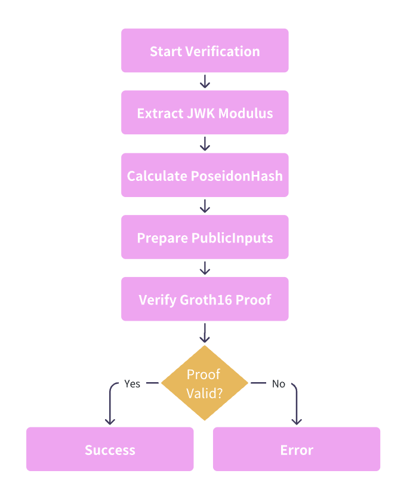
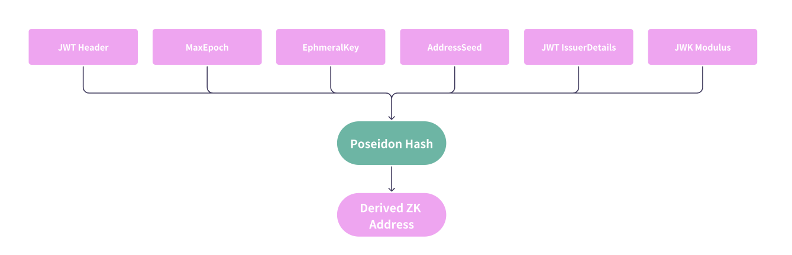

# Primitive ZkLogin: Robust, Secure & Efficient Foundation

## Overview

The `primitive/zklogin` crate provides the **core cryptographic logic, data structures, and trait interfaces** for zkLogin authentication in the KZero ecosystem. It is designed to be a reusable, no-std compatible Rust library, focused on:
- Zero-knowledge proof (ZKP) verification (Groth16, BN254)
- Poseidon hash implementation for ZK circuits
- JWK (JSON Web Key) parsing and provider abstraction
- Typed data structures for ZKLogin flows
- Security-critical input validation and error handling

## Core Components

### 1. ZkLogin Material (`ZkMaterial`)

`ZkMaterialV1<Moment>` encapsulates all cryptographic and session data required for a zkLogin authentication:
```rust
pub struct ZkMaterialV1<Moment> {
    pub provider: JwkProvider,        // OAuth provider (Google, GitHub, etc.)
    pub kid: Kid,                     // Key ID for JWK lookup
    pub inputs: ZkLoginInputs,        // ZK proof public inputs
    pub ephkey_expire_at: Moment,     // Ephemeral key expiration (block or timestamp)
}
```

**Key Features:**
- **Versioned Structure**: Supports multiple versions for backward compatibility
- **Provider Agnostic**: Works with multiple OAuth providers
- **Time-based Security**: Includes ephemeral key expiration
- **Proof Integration**: Contains all ZK proof verification data

### 2. JWK Provider System

The module supports multiple OAuth providers through a unified interface:

```rust
pub enum JwkProvider {
    Google,    // accounts.google.com
    Twitch,    // id.twitch.tv
    Facebook,  // www.facebook.com
    Kakao,     // kauth.kakao.com
    Apple,     // appleid.apple.com
    Slack,     // slack.com
    Github,    // token.actions.githubusercontent.com
}
```

### 3. Zero-Knowledge Proof System

Implements Groth16 proof verification over the BN254 curve, with strict type safety:
```rust
pub struct ZkLoginProof {
    pub a: CircomG1,
    pub b: CircomG2,
    pub c: CircomG1,
}
```
- **All group elements are validated for curve membership.**
- **Proofs are checked against public inputs derived from 'ZkLogin Material' and 'JWK'.**


### 4. Poseidon Hash Function

The module implements Poseidon hash for efficient zero-knowledge proof generation:

```rust
pub fn poseidon_zk_login(inputs: Vec<Fr>) -> Result<Bn254Fr, ZkAuthError>
```
- **Supports variable-length input vectors.**
- **Used for hashing 'ZkLogin Material' and public inputs.**

### 5. Trait Interfaces & Type Conversions

- **Trait-based design** for extensibility (e.g., `TryIntoEphPubKey`, `ReplaceSender`).
- **Type conversions** for AccountId, MultiAddress, etc., to support flexible integration with different runtimes or applications.

---

## Main Methods and Logic

### 1. ZK Login Verification (`verify_zk_login`)

```rust
pub fn verify_zk_login(
    &self,
    eph_pubkey: EphPubKey,
    address_seed: &AccountId32,
    jwk: &Jwk,
) -> ZkAuthResult<()> {
    // 1. Extract modulus from JWK
    // 2. Hash all public inputs (address_seed, eph_pubkey, modulus, etc.)
    // 3. Prepare Groth16 public inputs
    // 4. Verify Groth16 proof (BN254)
    // 5. Return Ok or detailed error
}
```

**Verification Flow:**




**Steps:**
1. **JWK Modulus Extraction**: Extract the `n` parameter from the JWK
2. **Hash Calculation**: Compute Poseidon hash of all inputs
3. **Public Input Preparation**: Prepare inputs for Groth16 verification
4. **Proof Verification**: Verify the zero-knowledge proof using BN254 curve
5. **Result Validation**: Return success or detailed error

### 2. JWK Fetching (`fetch_jwks`)

```rust
pub fn fetch_jwks<E>(
    &self,
    fetcher: impl Fn(&str) -> Result<serde_json::Value, E>,
) -> Result<Vec<Jwk>, JwkProviderErr<E>>
```
- **OAuth 2.0 discovery protocol**: Fetches provider config, extracts `jwks_uri`, fetches and parses JWKs.
- **Flexible fetcher**: Accepts any HTTP client or mock for testing.
- **Strict JSON schema validation** for JWKs.

**Method Description**

The fetch_jwks method is responsible for retrieving JSON Web Key Sets (JWKS) from OAuth providers by following the OAuth 2.0 discovery protocol.

1. Gets the well-known endpoint URL:
- Calls self.well_know_link() to obtain the OAuth provider's discovery endpoint URL (e.g., https://accounts.google.com/.well-known/openid_configuration)
2. Fetches the well-known document:
- Uses the provided `fetcher` function to make an HTTP request to the well-known endpoint
- The fetcher parameter allows for flexible HTTP client implementations
3. Extracts the JWKS URI
- Parses the JSON response to find the jwks_uri field
4. Fetches the actual JWKS:
- Makes a second HTTP request to the jwks_uri endpoint (e.g., https://www.googleapis.com/oauth2/v3/certs)
- Retrieves the JSON response containing the actual public keys
5. Parses and returns the JWKS: 
- Extracts the keys array from the response
- Deserializes the JSON into a Vec<Jwk> (vector of JSON Web Keys)
- Returns the actual JWK objects,
6. Error handling:
- Returns `JwkProviderErr::Fetch` if any HTTP request fails
- Returns `JwkProviderErr::NotFoundJwkUri` if the jwks_uri field is missing
- Returns `JwkProviderErr::NotFoundJwks` if the keys field is missing
- Returns `JwkProviderErr::InvalidJson` if the response format is unexpected
- Returns `JwkProviderErr::InvalidJwks` if JWK parsing fails

### 3. Input Hash Calculation (`calculate_all_inputs_hash`)

```rust
pub fn calculate_all_inputs_hash(
    &self,
    address_seed: U256,
    eph_pk_bytes: &EphPubKey,
    modulus: &[u8],
    max_epoch: u64,
) -> Result<Bn254Fr, ZkAuthError>
```
- **Used to hash all cryptographic inputs for ZK circuit public input.**
- **Handles edge cases and input validation.**




## Testing 

### Running the Tests

To run all tests:
```bash
cargo test -p primitive-zklogin --features testing
```

All tests should pass, covering the full zkLogin, JWK, proxy, and recovery flows, as well as error and edge cases. 

### 1. Affine Point Validation Tests

Tests ensure that all cryptographic points are valid on the BN254 curve:

```rust
#[test]
fn test_valid_affine_should_be_on_curve() {...}
fn test_invalid_affine_should_not_be_on_curve() {...}
fn test_invalid_affine_type_should_be_rejected() {...}
```

**Test Cases:**
- ✅ Valid points on curve
- ✅ Invalid points should be rejected
- ✅ Invalid type values should be rejected

### 2. Poseidon Hash Tests

Comprehensive testing of the Poseidon hash function:

```rust
#[test]
fn test_to_poseidon_hash() {...}
```

**Test Cases:**
- ✅ Empty input validation
- ✅ Single element hashing
- ✅ Multiple element hashing (1-32 elements)
- ✅ Edge case handling

### 3. Trait Implementation Tests

Tests for core trait implementations:

```rust
#[test]
fn test_replace_sender() {
    // Test signed extrinsic sender replacement
    // Test unsigned extrinsic handling
}

#[test]
fn test_try_into_eph_pubkey() {
    // Test AccountId32 conversion
    // Test MultiAddress conversions
    // Test invalid address types
}
```

### 4. ZK Login Integration Tests

Test the main workflow of the zkLogin verification:

```rust
#[test]
fn verify_zklogin() {
    // Test successful verification
    // Test with valid JWK and proof
}

#[test]
fn zk_login_should_fail_when_jwk_not_match() {
    // Test JWK mismatch scenarios
}

#[test]
fn zk_login_should_fail_when_eph_pubkey_not_match() {
    // Test ephemeral key mismatch
}
```

## Conclusion

The `primitive/zklogin` module provides a robust, secure, and efficient foundation for zero-knowledge login functionality in KZero. Its comprehensive testing strategy, security considerations, and performance optimizations make it suitable for production use in privacy-preserving blockchain applications.

The modular design allows for easy integration with various OAuth providers while maintaining strong cryptographic guarantees through zero-knowledge proofs. The extensive test coverage ensures reliability and correctness across different scenarios and edge cases. 