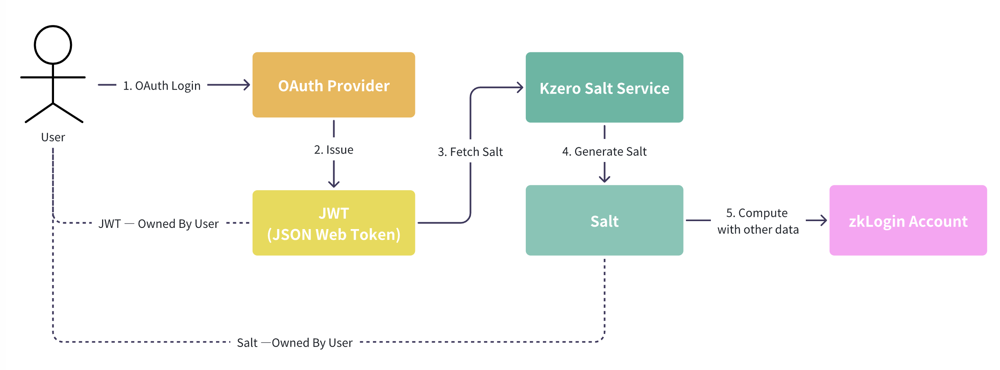
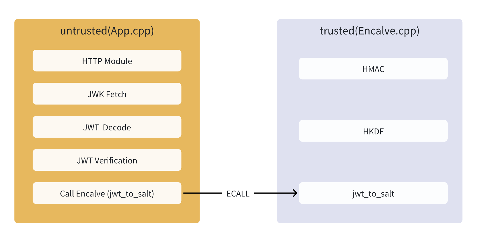

# Kzero Salt Service Technical Specification

## 1. Overview

### 1.1 What is Salt Service

Kzero Salt Service is a security service built on Intel SGX (Software Guard Extensions) technology, specifically designed to generate unique and deterministic salt for users. The primary purposes of this service are:

- **JWT to Salt Conversion**: Receives ID Tokens (JWT) obtained by users through JWT Providers (such as Google OAuth) and generates corresponding unique salt
- **Salt Used In zkLogin Address Computation**: The generated salt participates in the computation process of on-chain zkLogin Address
- **Privacy Protection**: Securely stores salt for users, preventing leakage of mapping relationships between on-chain addresses and OAuth2 (i.g. Google) Account.
- **Access Control**: The Salt server is not fully open to users; users can only query their own salt, ensuring data isolation

### 1.2 Core Features

- **Deterministic Generation**: Identical JWT inputs always produce identical salt outputs
- **Uniqueness Guarantee**: Different JWT inputs produce different salt outputs
- **Security Isolation**: Based on SGX Enclave technology, ensuring salt generation process executes in a protected environment
- **Multi-Provider Support**: Currently supports Google OAuth, extensible to support other JWT Providers

## 2. System Architecture and Workflow

### 2.1 Overall Architecture

The position of Salt Service in the overall architecture is shown in the following diagram:



### 2.2 Detailed Workflow

a. **User Authentication Phase**
   - 1. User authenticates their identity through OAuth2 Login (e.g., control over Google account)
   - 2. Google returns a JWT Token containing user identity information

b. **Salt Generation Phase**
   - 3. User calls Salt Service to obtain a unique and deterministic salt. During this process, Salt Service validates JWT validity (signature, expiration time, issuer information, etc.) and securely generates salt within the SGX Enclave

c. **Salt Return Phase**
   - 4. Returns the generated salt to the user
   - 5. User can use this salt to compute a unique and deterministic on-chain zkLogin Account (computation process can be referenced at [here](https://github.com/kzero-xyz/kzero-grant-docs/blob/main/kzero-circuit-spec.md#user-social-account---on-chain-address)

## 3. Runtime Environment

### 3.1 Production Environment Requirements

- **Hardware Requirements**: Servers supporting Intel SGX
- **Operating System**: Linux (Ubuntu 20.04+ recommended)
- **Architecture**: x86_64
- **SGX Mode**: Hardware mode support (production environment)

### 3.2 Development/Testing Environment

- **Docker Environment**: Using Docker to run SGX simulation mode
- **Operating System**: Ubuntu 20.04+ (recommended)
- **Architecture**: x86_64
- **SGX Mode**: SIM mode (simulation mode)

### 3.3 Deployment Configuration

Todo: This will be changed to online docker
```bash
# Build Docker image
docker build -t test-enclave:latest .

# Run container (simulation mode)
docker run -d -p 8080:8080 --name test-enclave-new -e SGX_MODE=SIM test-enclave:latest
```

## 4. Intel SGX Enclave Technology Deep Dive

### 4.1 What is SGX Enclave

Intel SGX (Software Guard Extensions) is a hardware-level security extension technology designed to protect sensitive data in applications from malware and privileged attacks. By using SGX, developers can execute code in secure containers called "enclaves," where sensitive data is encrypted and only trusted applications can access it.

The core concept of Intel SGX is the enclave, which is a protected memory region used to store and execute sensitive code and data. In the SGX environment, applications are divided into two parts: `untrusted` parts and `trusted` parts. The untrusted part contains untrusted code, while the trusted part contains code with higher security requirements. Our core logic `jwt_to_salt` is implemented in the trusted part.

### 4.2 Core Features of Enclave

- **Memory Isolation**: Enclave has independent memory space that cannot be directly accessed externally
- **Encryption Protection**: Data within the Enclave is encrypted in memory
- **Integrity Verification**: Ensures Enclave code has not been tampered with
- **Remote Attestation**: Allows external verification of Enclave authenticity and integrity

### 4.3 Core Mechanism -- ECALL

#### ECALL (Enclave Call)
- **Definition**: Function calls from untrusted applications to trusted Enclave internals
- **Purpose**: Execute protected operations, such as salt generation
- **Example**: `jwt_to_salt()` function

### 4.4 Enclave Workflow



## 5. App Enclave Implementation in the Project

### 5.1 Project Structure

```
kzero-salt-enclave-service/
├── App/                   # Untrusted application
│   ├── App.cpp            # Main application, includes HTTP server and JWT validation
│   ├── Enclave_u.c        # Generated untrusted interface
│   └── Enclave_u.h        # Untrusted interface header file
├── Enclave/               # Trusted Enclave code
    ├── Enclave.cpp        # Enclave internal implementation
    ├── Enclave.edl        # EDL interface definition
    ├── Enclave_t.c        # Generated trusted interface
    └── Enclave_t.h        # Trusted interface header file

```

### 5.2 App Enclave Core Functionality

#### 5.2.1 JWT Validation Module (App.cpp)

```cpp
// Supported Provider configurations
static const ProviderConfig PROVIDER_CONFIGS[] = {
    {"google", "https://www.googleapis.com/oauth2/v3/certs",  // jwk-url
     "https://accounts.google.com",  // issuer
     "560629365517-mt9j9arflcgi35i8hpoptr66qgo1lmfm.apps.googleusercontent.com", // audience
     1 // is_support_now
    }, 
    // Extensible to other Providers
};

// JWT validation process
int verify_jwt_for_provider(const char* token, ProviderType provider) {
    // 1. Get JWKS (JSON Web Key Set)
    // 2. Parse JWT Header to get kid
    // 3. Match corresponding public key
    // 4. Verify JWT signature
    // 5. Verify issuer and audience
    // 6. Check expiration time
}
```

#### 5.2.2 Salt Generation Module (Enclave.cpp)

```cpp
// Core Salt generation function
sgx_status_t jwt_to_salt(const uint8_t* some_string, size_t len, uint8_t* output_salt) {
    // 1. Parse JWT Payload
    // 2. Extract sub, iss, aud fields
    // 3. Use HKDF algorithm to generate Salt
    // 4. Return 16-byte Salt value
}
```

#### 5.2.3 HKDF Algorithm Implementation(Enclave.cpp)

The project uses HKDF (HMAC-based Key Derivation Function) algorithm to generate Salt:

```cpp
// HKDF implementation
static int hkdf(const uint8_t* salt, size_t salt_len,
                const uint8_t* ikm, size_t ikm_len,
                const uint8_t* info, size_t info_len,
                uint8_t* okm, size_t okm_len) {
    // Extract phase: Using HMAC-SHA256
    // Expand phase: Generate final output
}
```

### 5.3 Security Features

#### 5.3.1 Data Protection
- Salt generation is completed within the Enclave
- Sensitive data is encrypted in memory
- External access to the salt generation process is prevented

#### 5.3.2 Access Control
- Only verified JWTs can generate Salt
- Each user can only access their own Salt value
- Prevents Salt value leakage to external environments

#### 5.3.3 Integrity Guarantee
- Uses SGX hardware to guarantee code integrity
- Prevents malicious code injection and tampering
- Ensures correct execution of salt generation algorithms

### 5.4 API Interface

#### 5.4.1 HTTP Interface

```http
POST /get_salt
Content-Type: application/json

{
  "message": "eyJhbGciOiJSUzI1NiIs...",  // JWT Token
  "provider": "google"                    // Provider type
}
```

#### 5.4.2 Response Format

**Success Response:**
```json
{
  "salt": "12345678901234567890",
  "status": "success"
}
```

**Error Response:**
```json
{
  "error": "JWT token has expired",
  "status": "failed"
}
```

### 5.5 Error Handling

The project implements comprehensive error handling mechanisms:

```cpp
typedef enum {
    JWT_ERROR_NONE = 0,
    JWT_ERROR_INVALID_FORMAT = 1,
    JWT_ERROR_EXPIRED = 2,
    JWT_ERROR_INVALID_SIGNATURE = 3,
    JWT_ERROR_INVALID_ISSUER = 4,
    JWT_ERROR_INVALID_AUDIENCE = 5,
    JWT_ERROR_MISSING_KEY = 6,
    JWT_ERROR_NETWORK = 7,
    JWT_ERROR_NOT_SUPPORTED = 8,
    JWT_ERROR_UNKNOWN_PROVIDER = 9,
    JWT_ERROR = 10
} JWTErrorType;
```

## 6. Summary

Kzero Salt Service is a security service built on Intel SGX technology, providing reliable Salt generation functionality for the zkLogin system. Through hardware-level security protection, it ensures the confidentiality and integrity of user Salt data, providing a solid security foundation for the entire identity authentication and address generation process.

The service design fully considers security, scalability, and usability, meeting production environment requirements while leaving ample room for future feature extensions.
