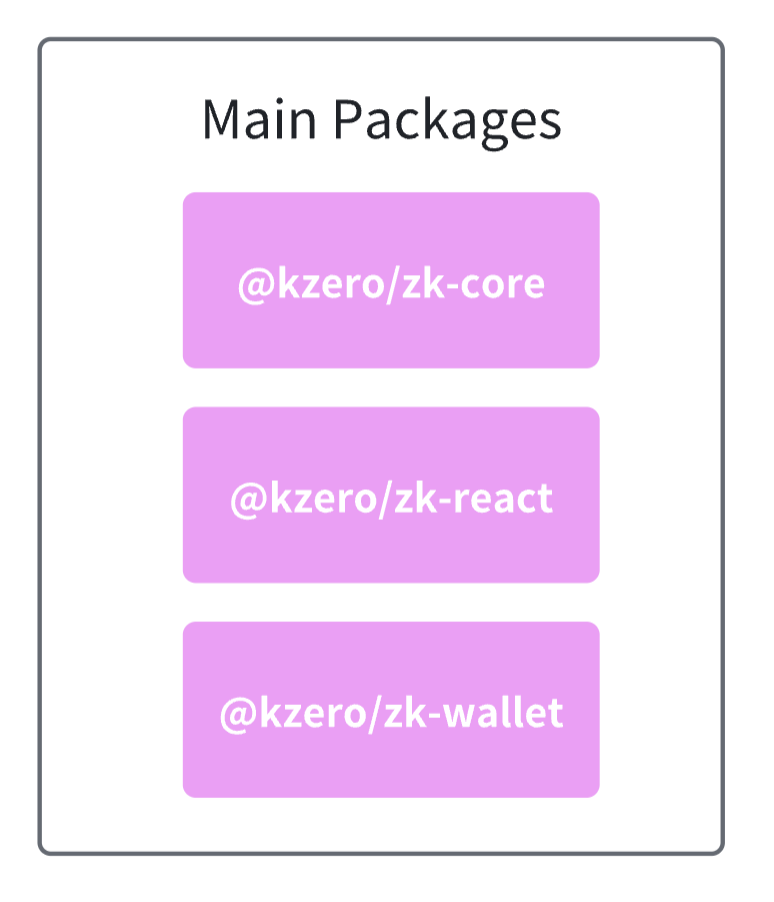
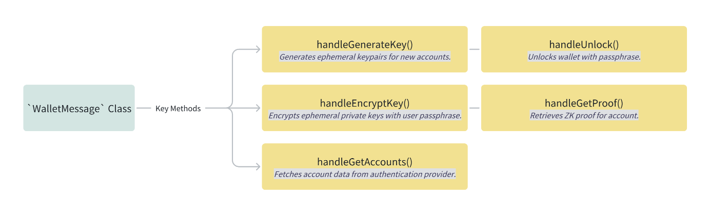

# KZero Wallet SDK - Technical Documentation

## Overview

The KZero Wallet is a comprehensive zero-knowledge (ZK) wallet SDK that enables seamless integration of Web2 authentication and transaction constructing and signing capabilities into web3 applications. Built on top of Polkadot's ecosystem, it provides a secure, user-friendly interface for managing ZK accounts and signing blockchain transactions.

The SDK leverages zero-knowledge proofs to enable users to authenticate using their social media accounts while maintaining privacy and security. This approach eliminates the need for traditional seed phrases while providing cryptographic security guarantees.



## Architecture

The SDK consists of three main packages working together to provide a complete wallet solution:

### Package Structure

```
@kzero/zk-core     - Provides the foundational ZK proof generation, account management, and type definitions
@kzero/zk-react    - Offers React-specific components, hooks, and theming system for UI integration
@kzero/zk-wallet   - Handles message communication, cryptographic operations, and key management
```

### External Dependencies
- **Polkadot API**: For blockchain interaction and transaction signing
- **Social Providers**: OAuth2/OpenID Connect integration with major platforms
- **Cryptographic Libraries**: Ed25519, Blake2, NaCl for secure operations

## Key Features

### 1. Zero-Knowledge Authentication

The SDK implements a sophisticated zero-knowledge authentication system that allows users to prove their identity without revealing sensitive information.


#### Social Login Integration
- **Supported Providers**: Google, Twitter, Apple, GitHub, etc.
- **OAuth2/OpenID Connect**: Industry-standard authentication protocols
- **Seamless Integration**: One-click login experience


#### ZK Proof Generation
- **Privacy-Preserving**: Users can authenticate without revealing personal data
- **Cryptographic Security**: Mathematical guarantees of identity verification
- **Automatic Generation**: Proofs are generated server-side and delivered securely

#### Ephemeral Key Management
- **Temporary Keypairs**: Generated locally for each session
- **Secure Storage**: Encrypted storage with user-controlled passphrases
- **Automatic Cleanup**: Keys are destroyed after session expiration

### 2. Account Management

Comprehensive account lifecycle management with real-time status tracking.

#### Account Status Tracking
- **Pending**: Initial authentication state
- **Encrypting**: Key encryption in progress
- **Ready**: Account fully operational

#### Proof Status Management
- **Pending**: ZK proof generation in progress
- **Generated**: Proof successfully created
- **Error**: Proof generation failed

### 3. Transaction Signing

Advanced transaction signing capabilities with Polkadot/Substrate integration.

#### Polkadot Integration
- **Full Compatibility**: Native support for Polkadot and Substrate networks
- **Runtime Compatibility**: Automatic adaptation to different runtime versions
- **Network Agnostic**: Works across multiple Polkadot parachains
- **Encrypted Keys**: Uses encrypted ephemeral keys for signing

## Installation & Setup

### Prerequisites

- **Node.js**: Version 20 or higher
- **Package Manager**: pnpm (recommended) or npm
- **Browser**: Modern browser with WebAssembly support

### Installation

```bash
# Install the SDK
npm install @kzero/example-wallet

# Or using pnpm
pnpm add @kzero/example-wallet
```

### Initial Setup

```typescript
import { WalletMessage } from '@kzero/zk-wallet';

// Initialize the wallet message handler
const walletMessage = new WalletMessage();

// The wallet is now ready to handle messages
```

## Core Components

### WalletMessage Class

The `WalletMessage` class is the central component that handles all wallet operations and serves as the primary interface between the wallet and the parent application.



#### Constructor
```typescript
const walletMessage = new WalletMessage();
```

#### Key Methods

##### `handleGenerateKey()`
Generates ephemeral keypairs for new accounts.
- **Input**: None
- **Output**: `{ publicKey: Hex }`
- **Security**: Uses cryptographically secure random number generation

##### `handleEncryptKey()`
Encrypts ephemeral private keys with user passphrase.
- **Input**: `{ passphrase?: string; ephemeralPublicKey: Hex }`
- **Output**: `null` (success) or error
- **Security**: Uses Blake2 hash for key derivation

##### `handleGetAccounts()`
Retrieves all available accounts.
- **Input**: None
- **Output**: `{ accounts: ZkAccount[] }`
- **Storage**: Reads from localStorage

##### `handleRetrieveAccount()`
Fetches account data from authentication provider.
- **Input**: `{ ephemeralPublicKey: Hex }`
- **Output**: `{ account: ZkAccount }`
- **Network**: Makes HTTP requests to auth service

##### `handleUnlock()`
Unlocks wallet with passphrase.
- **Input**: `{ passphrase: string }`
- **Output**: `null` (success) or error
- **Security**: Validates passphrase and decrypts keys

##### `handleGetProof()`
Retrieves ZK proof for account.
- **Input**: `{ ephemeralPublicKey: Hex }`
- **Output**: `{ proof: Proof | null }`
- **Storage**: Reads from localStorage

### Account Types

#### ZkAccount Interface

```typescript
type ZkAccount = {
  type: 'zk';
  address: Hex;                    // Blockchain address
  provider: LoginProvider;         // Authentication provider
  ephemeralPublicKey: Hex;        // Temporary public key
  name: string;                   // User display name
  email?: string;                  // User email (optional)
  picture?: string;               // User avatar URL (optional)
  status: 'pending' | 'encrypting' | 'ready';
  proofStatus: 'pending' | 'error' | 'generated';
};
```

#### LoginProvider Type

```typescript
type LoginProvider = 'google' | 'twitter' | 'apple' | 'github' | 'telegram' | 'discord';
```

#### Proof Interface

```typescript
type Proof = {
  updatedAt: number;              // Last update timestamp
  createdAt: number;              // Creation timestamp
  maxEpoch: string;               // Maximum epoch validity
  kid: number;                    // Key identifier
  email?: string;                 // User email
  name: string;                   // User name
  picture?: string;               // User picture
  provider: LoginProvider;        // Authentication provider
} & (
  | { status: 'waiting' | 'generating'; zkAddress: Hex }
  | {
      status: 'generated';
      proof: {
        proof_points: {
          a: [string, string, string];
          b: [[string, string], [string, string], [string, string]];
          c: [string, string, string];
        };
        iss_base64_details: {
          value: string;
          index_mod_4: number;
        };
        header: string;
      };
      public: [`${number}`];
      zkAddress: Hex;
    }
  | { status: 'failed'; zkAddress?: Hex }
);
```

## Usage Examples

### 1. Basic Wallet Integration

```typescript
import React, { useEffect } from 'react';
import { WalletMessage } from '@kzero/zk-wallet';

function App() {
  useEffect(() => {
    // Initialize wallet message handler
    new WalletMessage();
    
    // Notify parent window that wallet is ready
    window.parent.postMessage({ type: 'wallet.ready' }, '*');
  }, []);

  return <div>Wallet Ready</div>;
}
```

### 2. Account Authentication Flow

```typescript
import { useParams } from 'react-router-dom';

function Auth() {
  const { provider, ephemeralPublicKey } = useParams<{ 
    provider: string; 
    ephemeralPublicKey: string 
  }>();

  useEffect(() => {
    if (provider && ephemeralPublicKey) {
      // Redirect to authentication provider
      fetch(`https://demo-auth.kzero.xyz/auth/${provider}?ephemeral_public_key=${ephemeralPublicKey}`, {
        credentials: 'include'
      })
        .then((res) => res.json())
        .then(({ url }) => {
          window.location.href = url;
        })
        .catch((error) => {
          console.error('Authentication failed:', error);
        });
    }
  }, [provider, ephemeralPublicKey]);

  return <div>Redirecting to {provider}...</div>;
}
```

### 3. Transaction Signing

```typescript
import { ApiPromise, WsProvider } from '@polkadot/api';
import { createPair } from '@polkadot/keyring';
import { encodeAddress } from '@polkadot/util-crypto';
import { prepareCall } from './parseCall';

async function signTransaction(api: ApiPromise, method: string, address: string) {
  try {
    // Get account and proof
    const account = getAccount(address);
    if (!account || account.type !== 'zk') {
      throw new Error('Invalid account');
    }

    const proof = getProof(account.ephemeralPublicKey);
    if (!proof || proof.status !== 'generated') {
      throw new Error('Proof not available');
    }
    
    // Create keypair from encrypted ephemeral key
    const ephemeralEncrypted = JSON.parse(
      localStorage.getItem(`ephemeral_keypair:${account.ephemeralPublicKey}`) || 'null'
    );
    
    if (!ephemeralEncrypted) {
      throw new Error('Encrypted key not found');
    }

    const passphrase = JSON.parse(sessionStorage.getItem('passphrase') || 'null');
    if (!passphrase) {
      throw new Error('Wallet not unlocked');
    }
    
    const pair = createPair(
      { toSS58: (address) => encodeAddress(address), type: 'ed25519' },
      ed25519PairFromSecret(
        decrypt(
          u8aToU8a(ephemeralEncrypted),
          blake2AsU8a(passphrase)
        )
      )
    );
    
    // Prepare and sign the transaction
    const { uxt, zkMaterial, address: zkAddress } = await prepareCall(
      api,
      method,
      pair,
      proof
    );
    
    const tx = api.tx.zkLogin.submitZkloginUnsigned(
      api.createType('Bytes', uxt.toU8a()),
      api.createType('MultiAddress', { Id: zkAddress }),
      zkMaterial
    );
    
    return tx;
  } catch (error) {
    console.error('Transaction signing failed:', error);
    throw error;
  }
}
```

### 4. Account Management

```typescript
import { useAccounts } from '@kzero/zk-react';

function AccountManager() {
  const { accounts, isLoading, error } = useAccounts();

  if (isLoading) return <div>Loading accounts...</div>;
  if (error) return <div>Error: {error.message}</div>;

  return (
    <div>
      <h2>Your Accounts</h2>
      {accounts.map((account) => (
        <div key={account.address}>
          <h3>{account.name}</h3>
          <p>Provider: {account.provider}</p>
          <p>Status: {account.status}</p>
          <p>Address: {account.address}</p>
        </div>
      ))}
    </div>
  );
}
```

## Configuration

### Environment Variables

```bash
# Authentication service URL
AUTH_SERVICE_URL=https://demo-auth.kzero.xyz

# Polkadot node endpoint
POLKADOT_NODE_URL=wss://node-template.kzero.xyz

# Development mode
NODE_ENV=development
```

### Network Configuration

The SDK supports custom Polkadot network configurations:

```typescript
import { ApiPromise, WsProvider } from '@polkadot/api';

// Custom network configuration
const api = new ApiPromise({ 
  provider: new WsProvider('wss://your-custom-node-url'),
  types: {
    // Custom type definitions
  }
});
```

### Provider Configuration

```typescript
// Configure supported authentication providers
const providers = {
  google: {
    clientId: 'your-google-client-id',
    redirectUri: 'https://your-app.com/auth/google'
  },
  twitter: {
    clientId: 'your-twitter-client-id',
    redirectUri: 'https://your-app.com/auth/twitter'
  }
  // ... other providers
};
```

## Error Handling

The SDK provides comprehensive error handling for common scenarios:

### Error Types

#### Authentication Errors
- **Invalid Credentials**: User authentication failed
- **Provider Errors**: Authentication provider issues
- **Network Errors**: Connection problems with auth service

#### Key Management Errors
- **Encryption Failures**: Key encryption/decryption errors
- **Storage Errors**: Local storage access issues
- **Passphrase Errors**: Invalid or missing passphrases

#### Transaction Errors
- **Invalid Calls**: Malformed blockchain calls
- **Insufficient Funds**: Account balance too low
- **Network Issues**: Blockchain node connection problems

#### Proof Errors
- **Generation Failures**: ZK proof generation errors
- **Validation Errors**: Proof verification failures
- **Expiration Errors**: Proof has expired

### Error Handling Patterns

```typescript
// Example error handling
try {
  const result = await walletOperation();
  return result;
} catch (error) {
  if (error instanceof AuthenticationError) {
    // Handle authentication errors
    console.error('Authentication failed:', error.message);
    // Redirect to login
  } else if (error instanceof KeyManagementError) {
    // Handle key management errors
    console.error('Key operation failed:', error.message);
    // Clear sensitive data
  } else if (error instanceof TransactionError) {
    // Handle transaction errors
    console.error('Transaction failed:', error.message);
    // Show user-friendly message
  } else {
    // Handle unexpected errors
    console.error('Unexpected error:', error);
    // Log for debugging
  }
}
```

## Development Guide

### Building the SDK

```bash
# Install dependencies
pnpm install

# Build all packages
pnpm build

# Run development server
pnpm dev
```

### Testing

```bash
# Run type checking
pnpm check-types

# Run tests
pnpm test

# Run tests in watch mode
pnpm test:watch
```

### Project Structure

```
example-wallet/
├── src/
│   ├── App.tsx              # Main application component
│   ├── Auth.tsx             # Authentication component
│   ├── Home.tsx             # Home page component
│   ├── SignPayload/         # Transaction signing components
│   │   ├── index.tsx        # Main signing component
│   │   ├── Content.tsx      # Content wrapper
│   │   ├── Submit.tsx       # Submit functionality
│   │   ├── CallDisplay.tsx  # Call display component
│   │   ├── RequestInfo.tsx  # Request information
│   │   └── utils.ts         # Utility functions
│   ├── parseCall.ts         # Call parsing utilities
│   ├── utils/               # Additional utilities
│   └── icons/               # Icon components
├── public/                  # Static assets
├── package.json            # Package configuration
└── vite.config.ts          # Vite configuration
```

### Development Scripts

- `pnpm build` - Build all packages
- `pnpm dev` - Start development mode for core packages
- `pnpm dev:example` - Start the basic example
- `pnpm dev:wallet` - Start the wallet example
- `pnpm test` - Run tests
- `pnpm test:watch` - Run tests in watch mode
- `pnpm lint` - Run ESLint
- `pnpm check-types` - Run TypeScript type checking

## License

GPL-3.0

## Support

For technical support and questions:

- **GitHub Issues**: [https://github.com/kzero-xyz/kzero-wallet/issues](https://github.com/kzero-xyz/kzero-wallet/issues)
- **Github Repo**: [https://github.com/kzero-xyz/kzero-wallet](https://github.com/kzero-xyz/kzero-wallet)

---

*This technical documentation provides comprehensive coverage of the KZero Wallet SDK. For additional resources and advanced usage patterns, please refer to the individual package documentation and examples.*