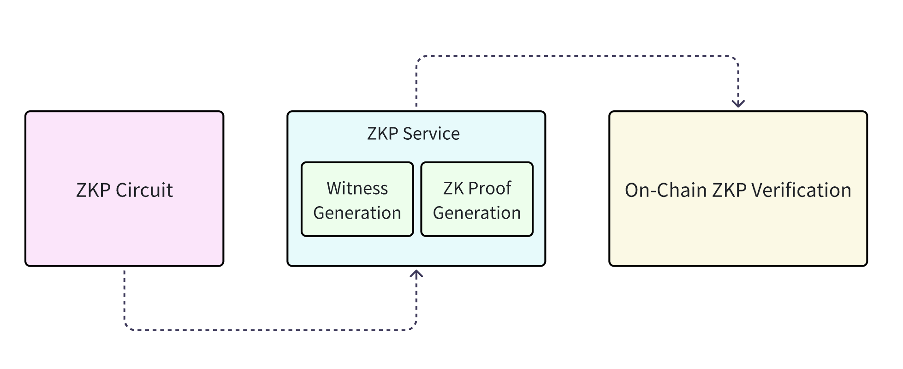
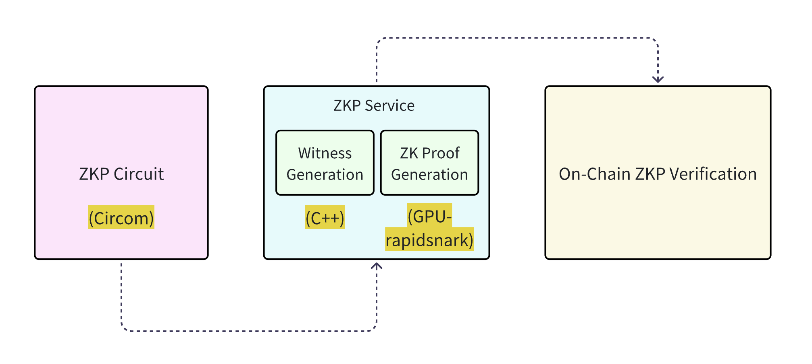

# Rationale for Adopting Existing zkProof Generation Frameworks in Kzero
## Introduction
In the early stages of developing the Kzero protocol, our team embarked on a comprehensive exploration of the zero-knowledge proof (ZKP) landscape. We conducted an in-depth evaluation of over many prominent ZKP frameworks, including `Groth16`, `PLONK`, `Halo2`, and some other `STARK/SNARK-based` systems, assessing each for performance, scalability, tooling maturity, and ecosystem support. ​

Building a custom ZKP generation service would entail significant engineering challenges, such as implementing low-level cryptographic primitives, optimizing performance (including GPU acceleration), and ensuring correctness and security across the entire stack. 

Therefore, after comprehensive research, we made the final decision to using the current architecture for implementing Kzero, ensuring an optimal balance between engineering efficiency and the delivery of high-quality results.

## Engineering Complexity Assessment

Building a fully customized zkProof stack would require deep domain knowledge in:
- Arithmetic circuit coding & optimizating.
- Cryptographic protocol design.
- Backend integration with GPU-acceleration ZKP Service and SNARK-friendly data structures.
- Low-level memory and performance profiling (especially in C++ and GPU environments).

## Implementation Overview

Our implementation strategy involved the following components:
- **Circuit Construction**: Utilized the `circom` language to construct zero-knowledge proof circuits.
- **Witness Generation**: Employed a `C++ based` implementation to generate witnesses efficiently.
- **Proof Generation**: Leveraged the GPU-accelerated version of rapidsnark for high-performance zkProof computation.

## Comparative Evaluation of Available Toolchains
Before finalizing our zero-knowledge proof (ZKP) stack for the Kzero project, we conducted a comprehensive evaluation of several prominent ZKP protocols and their associated toolchains, including:

- Groth16
- PLONK
- Halo
- Others

### Selection of Groth16
After thorough analysis and benchmarking, we selected Groth16 as our ZKP protocol algorithm, based on the following considerations:

#### 1. Proof Size and Verification Efficiency
Groth16 produces succinct proofs that can be verified in milliseconds, making it ideal for applications where on-chain verification efficiency is paramount.

#### 2. Mature Tooling Ecosystem
Groth16 benefits from a well-established ecosystem, including tools like circom, snarkjs, and rapidsnark, which facilitate circuit design, witness generation, and proof computation.

#### 3. Trusted Setup Consideration
While Groth16 requires a circuit-specific trusted setup, this was acceptable for our use case, where the circuits are stable and not frequently changing.

### Toolchain Optimization
To maximize performance and user experience, we adopted the following toolchain:
#### 1. Circuit Design
Utilized `circom` for defining ZKP circuits, leveraging its expressive syntax and community support.
#### 2. Witness Generation
Implemented in `C++` to efficiently compute witnesses, ensuring compatibility with downstream tools.
#### 3. Proof Generation
Employed the **GPU-accelerated** version of `rapidsnark` to significantly reduce proof generation time, enhancing responsiveness in user-facing applications.

This combination allows us to achieve a balance between development efficiency, performance, and maintainability.

## Reasons for Choosing Existing Frameworks
### 1. Engineering Efficiency
Utilizing established tools like `Circom`, `Rapidsnark` allows us to bypass the complexities of low-level cryptographic implementations and focus on the specific needs of our protocol. 
This approach not only ensured faster development but also minimized the risk of errors and bugs associated with custom-built solutions, providing a solid foundation for future protocol upgrades and improvements.

### 2. Reliability and Security
Existing frameworks like rapidsnark have been extensively tested and are widely used in the community. Their proven reliability and security profiles provided confidence in our implementation, reducing the risk of introducing vulnerabilities.

### 3. Performance Optimization
The GPU-accelerated version of rapidsnark offers significant performance benefits, enabling faster proof generation. 

### 4. Maintainability
Leveraging open-source tools ensures ongoing support and updates from the community. This approach enhances the maintainability of our system, as improvements and bug fixes are continuously integrated into these frameworks.

## Conclusion
Integrating existing zkProof generation frameworks in the Kzero project is a strategic decision aimed at optimizing engineering resources, ensuring reliability, and achieving high performance. This approach allowed us to deliver a robust and scalable solution within our project timelines, focusing our efforts on the unique aspects of the Kzero protocol.