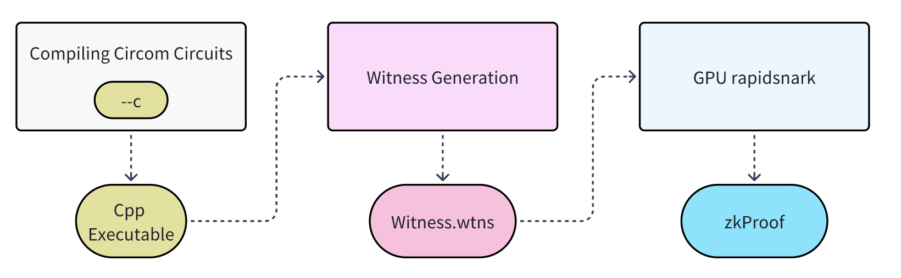

# A Comparative Analysis of Witness and Proof Generation Approaches for Kzero

## Introduction
In modern zero-knowledge proof (ZKP) systems, the efficiency of witness generation and proof computation is critical. We compared several methods for witness computation and proof generation, including using WebAssembly (WASM) for witness calculation, standard snark tools, and both CPU and GPU variants of rapidsnark and some other approaches. This article details the comparisons, benchmarks, and reasoning that led to our final technical solution.

## Methodology Overview
Our approach is based on two key phases:
1. **Witness Generation:** Using Circom-based circuits to compute the witness.
2. **Proof Generation:** Using snark to generate the zk-proof.

While there are multiple options for both phases, our final decision was to:
- **Compile the circuit with Circom to generate C++ files.**
- **Generate the witness using a C++ witness calculator.**
- **Generate the zk-proof using the GPU version of rapidsnark.**

In the following sections, we detail why alternative approaches were not adopted and how our selected pipeline outperforms them.

## Comparing Witness Generation: C++ vs. WASM

### The WASM Approach
An alternative method to compute the witness involves using WebAssembly, when compile the Kzero Circuit, we can add flag `--wasm` or `--c`:
```bash=
circom zkLogin.circom --r1cs --wasm --sym --c
```
> `--wasm`: It generates the directory zkLogin_js that contains the Wasm code (zkLogin.wasm) and other files needed to generate the witness.
> `--c`:It generates the directory zkLogin_cpp that contains several files (zkLogin.cpp, zkLogin.dat, and other common files for every compiled program like main.cpp, MakeFile, etc) needed to compile the C++ code to generate the witness.

After calling the circom compiler with the flag` --wasm `and the circuit zkLogin.circom we can find a zkLogin_js folder that contains the Wasm code in zkLogin.wasm and all the needed JavaScript files.

```bash
cd zkLogin_js
# Prepare your input in a file called input.json
node generate_witness.js zkLogin.wasm input.json witness.wtns
```
This method generates a witness file (witness.wtns) encoded in a binary format compatible with snarkjs. Both the WASM and C++ approaches ultimately produce identical witness files.

### Limitations of the WASM Approach
####  Performance Concerns
For large circuits, the WASM-based witness calculator is notably slower. Benchmarks show that the C++ implementation can be up to 10× faster than its WASM counterpart, especially when processing complex circuits with a large number of constraints.
-  Time of WASM Approach
```bash=
time node zkLogin_js/generate_witness.js zkLogin_js/zkLogin.wasm circuits/input.json witness.wtns

real    0m5.507s
user    0m5.661s
sys     0m0.159s
```
-  Time of C Approach

```bash=
time ./zkLogin ../circuits/input.json witness.wtns

real    0m0.576s
user    0m0.440s
sys     0m0.073s
```

#### Scalability
WASM may introduce overhead when running in Node.js, affecting throughput in service environments.


### Benefits of the C++ Approach
#### Speed
Native C++ compilation leverages optimized hardware instructions and multithreading. In our internal tests, the C++ witness calculator outperformed the WASM version by a significant margin.

#### Efficiency for Large Circuits
For circuits with millions of constraints, the C++ approach scales much better.

#### Ecosystem Integration
The C++ build integrates well with existing benchmarking tools and performance profiling, enabling better fine-tuning of the process.

## Comparing Proof Generation: CPU vs. GPU rapidsnark vs. Standard Snark

When generating zk-proofs, the choice of tool greatly impacts performance. We compared three approaches:

- **Standard Snark (e.g., snarkjs):** Traditional snark tools often require 30-40 seconds to generate a Kzero Proof. This level of latency is too slow for real-time or high-throughput service applications.
- **CPU-based rapidsnark:** While the CPU version of rapidsnark offers improved performance compared to standard snark methods, it still falls short of meeting the stringent requirements for large-scale deployments.
- **GPU-based rapidsnark:** Leveraging GPU acceleration, the GPU version significantly reduces proof generation time, achieving substantial speed-ups over both standard snark and CPU-based rapidsnark.

This comparison clearly demonstrates that the GPU-accelerated approach is far more suitable for production environments where rapid and efficient proof generation is critical.


### The Standard (CPU) Version
Standard rapidsnark is capable of generating zk-proofs, but it runs solely on the CPU. While sufficient for small-scale testing, the CPU version suffers from performance bottlenecks:

- Throughput Limitations: For large circuits, CPU-based proof generation can become prohibitively slow.
- Inefficient Parallelism: Many proof components are highly parallelizable. The CPU version cannot fully exploit this potential.

### Why GPU-Accelerated rapidsnark?
After benchmarking multiple approaches, our research indicated that:

- Significant Speedups: The GPU version of rapidsnark leverages thousands of CUDA cores to perform parallel computations, resulting in dramatic speed improvements.
- Service-Level Performance: For production services that require real-time or near real-time ZKP generation, GPU acceleration is a game changer.
- Scalability: With the GPU approach, large and complex circuits are processed much faster, reducing overall latency and resource consumption.

### Benchmark Insights
Preliminary benchmarks indicate:
- Up to 3-5× speedup in proof generation time when using the GPU version versus the CPU version.
- Reduced energy consumption per proof, making the GPU approach more sustainable for large-scale deployments.

#### CPU Rapidsnark
```bash=
generate proof: 1024 ms
write proof to file: 0 ms
write public+o fi1℃: 8 m
prover total: 1054 ms
```
#### GPU Rapidsnark
```bash=
enerate proof. 373 mc
irite proof to file: 0 ms
rite public to file: 0 ms
rover cuda total; 397 ms
```

## Final Workflow and Technical Advantages
Our final pipeline involves:
1. Compiling Circom Circuits to C++ Files:
This produces an optimized C++ witness calculator, which is essential for large-scale computations.
2. Witness Generation Using C++:
The witness is computed rapidly, benefiting from native execution speeds.
3. Proof Generation Using GPU rapidsnark:
The use of a GPU significantly reduces proof generation time, as demonstrated by our benchmarks.



## Performance Comparison Table


| Approach | Witness Generation Speed | Proof Generation Speed | Suitability for Large Circuits  |
| -------- | -------- | -------- | -------- |
| WASM-based Witness Calculator     | Moderate     | N/A     | Low |
| C++-based Witness Calculator     | High     | N/A     | High |
| Standard Snark Proof Gen     | N/A     | Low     | Low |
| CPU-based rapidsnark Proof Gen     | N/A     | Moderate     | Moderate |
| GPU-based rapidsnark Proof Gen     | N/A     | High     | High |
> Note: The above benchmarks are based on internal tests and publicly available data.

## Conclusion
Our research and benchmarking efforts have demonstrated that the combination of a C++ witness calculator and GPU-accelerated rapidsnark provides a robust, scalable, and high-performance solution for Kzero. This technical approach not only minimizes latency but also ensures that our system can handle complex circuits efficiently. By thoroughly comparing alternative methods—from WASM-based calculations to CPU approaches — we have established that our chosen pipeline represents a significant advancement in ZKP generation technology.

This comprehensive analysis underscores the extensive work involved in evaluating and optimizing ZKP systems and confirms that our technical solution is among the most efficient available.

## References
- Circom: https://github.com/iden3/circom
- Kzero Circuit: https://github.com/kzero-xyz/kzero-circuit
- Snark: https://github.com/iden3/snarkjs
- Standard rapidsnark: https://github.com/iden3/rapidsnark 
- GPU-based rapidsnark: https://github.com/kzero-xyz/rapidsnark-gpu
- ICICLE Project Prerequisites: https://github.com/ingonyama-zk/icicle?tab=readme-ov-file#prerequisites
